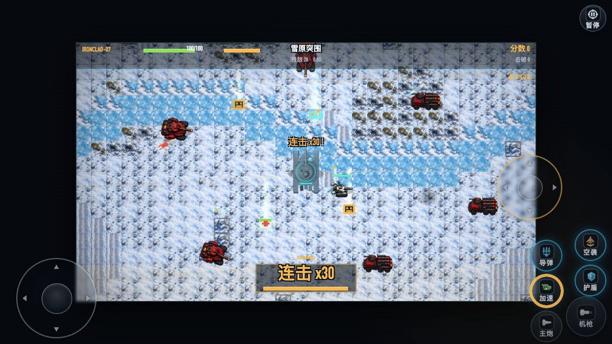
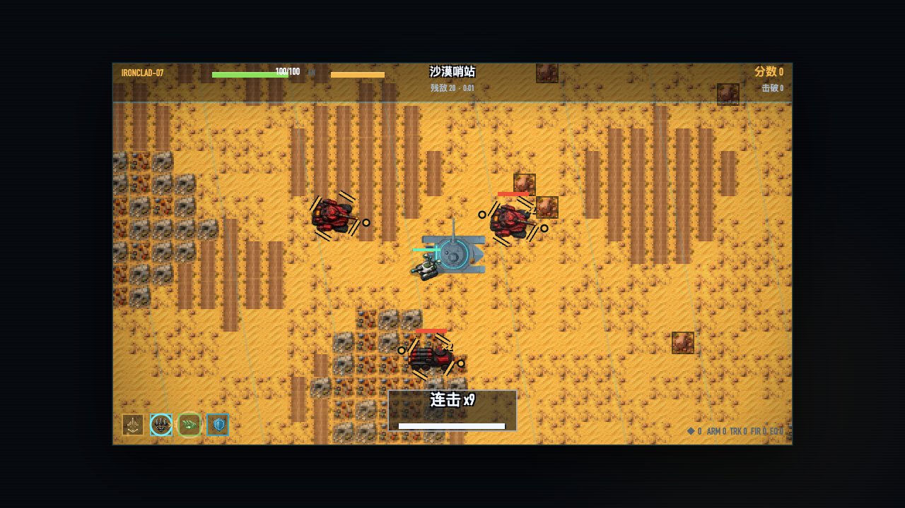
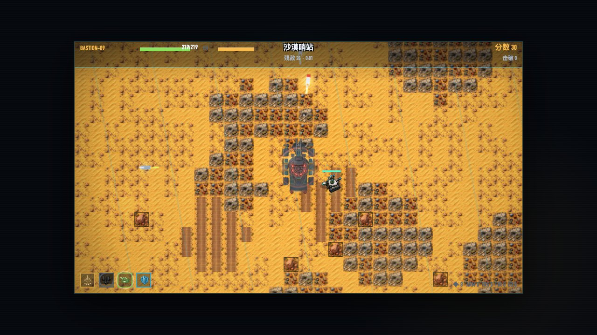
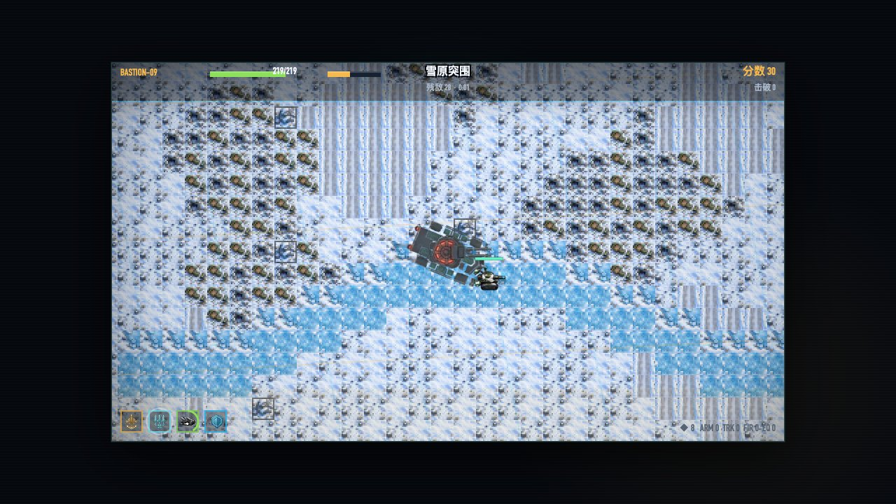
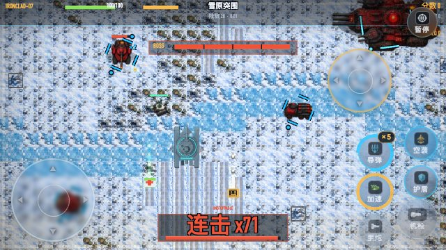
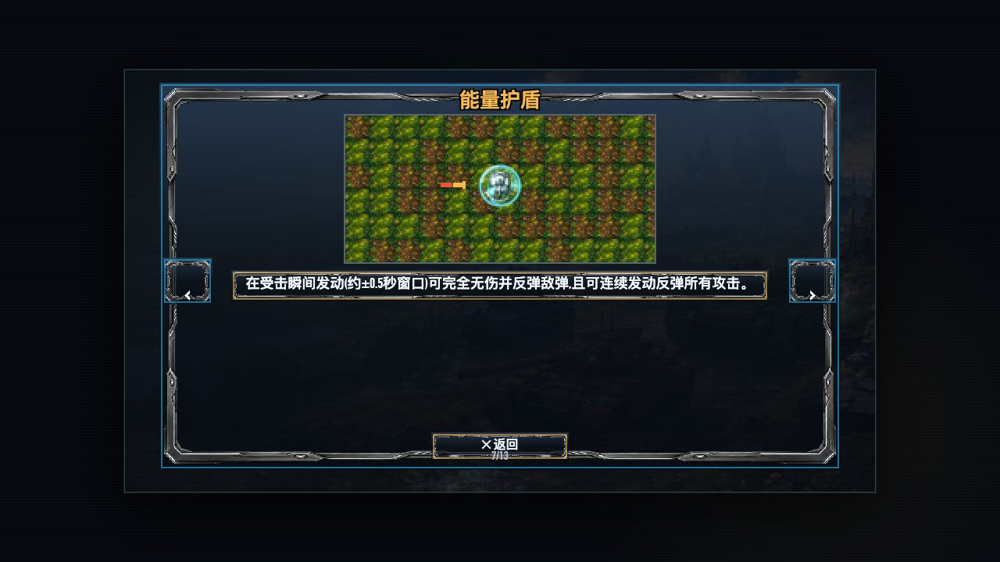

# 钢铁咆哮·坦克大战（Steel Roar · Tank Rampage）

横版坦克突击动作游戏：驾驶孤军坦克穿越**七大主题战场**，击破敌军、捡强化部件、弹反敌弹、轰穿 BOSS 与它的精英护卫队——通关后进入更高强度的下一周目，无限循环。

**当前版本 v1.8.1「UI 全面换装」**（Release 线：v1.8.0 双摇杆炮塔独立瞄准 · 多锁导弹 · 惯性漂移 · 伤害管线 2.0 → **v1.8.1 AI 素材 UI 全面接入：标题大图 · 金属九宫格 · 图标武器 HUD · 触屏按钮即 HUD · 整备页重排**）

> 架构里程碑线（vNext-v3.x）：v14 高清 AI 立绘 → v15 俯视 16 向单位 + 地形图集 → v1.5 七主题关卡与玻璃 UI → v1.6 机动特效与 BOSS 护卫队 → v1.7 手感三改（震动分级 / 冲刺残影 / 3D 等离子护罩）→ v1.7.1 残影彗尾化 → v1.8.1 UI 资产换装

- ▶ 在线游玩（GitHub Pages）：https://rance1230.github.io/steel-roar-tank-battle/
- 📦 Android APK / 单文件 `index.html`：[GitHub Releases](https://github.com/rance1230/steel-roar-tank-battle/releases)
- 💻 桌面端：双击 `index.html` 即玩（Chrome / Edge / Firefox / Safari）

---

## 游戏截图

| 标题画面 | 选择机体（实车预览） | 选择僚机 |
|---|---|---|
|  |  |  |

| 沙漠哨站·触屏战斗（图标按键+双摇杆） | 雪原突围·主题战场 | 3D 等离子护罩 |
|---|---|---|
|  |  |  |

| BOSS 与精英护卫队 | 战地整备（维修台实时坦克+部件面板） | 内置操作说明（13 页） |
|---|---|---|
|  |  |  |

**v1.8 新系统截图**

| 双摇杆战斗（移动+瞄准独立） | 多锁导弹 · 主锁定框+叠弹节点 ×N | 护盾弹反 · 蓝白粒子漩涡 |
|---|---|---|
|  |  |  |

| 冰面漂移 · 履带拖印与喷雪 | 触屏按钮即 HUD（图标+充能环+×N 锁数） | 帮助页 · 触屏可见按钮 |
|---|---|---|
|  |  |  |

---

## 核心特色

- **七大主题战场**：沙漠哨站 → 林地圣域 → 雨巷孤城 → 工业废墟 → 雪原突围 → 夜幕要塞 → 终焉战场。每关专属调色、环境粒子、v15 地形图集瓦片，以及主题化减速地形（油污 / 能量地板 / 熔岩裂隙）。
- **高清 AI 立绘单位**：我方三机体、僚机、敌军与 BOSS 陆舰均为正交俯视 16 方向精绘 sprite，平滑转向、阵营辉光、受击闪白。
- **四种武器**：机枪连发 / 主炮范围爆炸 / 蓄力追踪导弹（突击型三枚分锁）/ 空袭轰炸。
- **护盾弹反**：受击瞬间开启可完全无伤并把敌弹反弹回去；完美格挡（≤0.12s）伤害更强、顿帧保连击。
- **冲撞破门**：高速冲撞触发零距离炮击 ×1.35，按敌质量击飞、撞飞连锁（深度≤3）。
- **连击与 Overdrive**：5 秒连击链，连击越高掉落越好，60+ 进入 Overdrive（射速/移速提升+金色尾焰）。
- **BOSS 精英护卫队**：BOSS 不再单挑——4+ 精英随行环布合围，BOSS 冲锋前有「!!」预警，击破 BOSS 护卫溃散。
- **v1.7 手感三改**：3D 等离子护罩（球面明暗+经纬弧线+环绕能量点，三机体尺寸各异）；震动分级（机枪微震/主炮轻震/导弹中震/击破重震封顶、BOSS 击破延长）；水面涟漪/冰面碎晶/熔岩余烬等地形特效全面增强。
- **v1.7.1 残影彗尾**：冲刺残影改为彗尾模型——条数随实际冲刺位移逐渐增多（封顶 6 条、逐条变浅、沿路径弯折跟随），顶墙卡住或松开时残影收缩消散；卡住时不再原地堆积粒子与履带印。
- **v1.7.2 手柄映射改键**：修复手柄改键被确认键自身抢先绑死的 bug（先等确认键松开再捕获新键，选中功能 → 确认 → 按想要的键即改并存档）；映射列表显示 A/X/Y/RB/STA 等友好键名、捕获中闪烁 `?`、绑定成功 toast；安卓 HID 手柄十字键（HAT 轴）可绑定。
- **v1.8 双摇杆炮塔**：炮塔与机枪独立于车体 360° 瞄准——手柄右摇杆 / 触屏右虚拟摇杆 / 键盘方向键（WASD 移动 + 方向键瞄准）；松手永久保持瞄准角，车体与炮塔分层 HD 素材独立旋转。
- **v1.8 多锁导弹**：按住蓄力，0.2 秒获首锁、其后每 +0.15~0.22s（按机型）多锁一个目标，单目标可叠多锁（同心准环 ×N 标记）；松开齐射最多 6 枚错峰出膛；敌死目标发射时自动重锁最近敌，无目标沿炮塔直射；真实冷却（1.8/2.2/2.6s 按机型）期间禁蓄力。
- **v1.8 惯性驾驶**：质量/加速/转向/侧向抓地/制动五参数车型手感——突击型易甩尾、重装难急停撞得重；制动滑行不急停；冰面抓地 ×0.3、河面 ×0.6、泥地减速 0.55×；急转侧滑带加浓履带拖印与侧向扬尘/喷雪。
- **v1.8 护盾弹反增强**：连发护盾（短真空设计，无永久盾）；同帧多发来袭一次性全部反弹并合并为更强反馈（顿帧+强震+×N 浮字）；弹反瞬间蓝白圆形粒子漩涡，完美格挡漩涡更大更快更亮。
- **v1.8 战斗再平衡**：敌军耐久上调（坦克 ×1.7 / 卡车 ×1.5）且 L4+ 射速 +10%；我方武器数值下调换取战斗时长；坦克学会侧闪（履带亮光预警 → 0.12-0.3s 反应延迟横移，高难度更机警）；冲撞改为高风险高回报——非 BOSS 直接碾杀（CRUSH!），BOSS 大伤害+硬直但永不即杀。
- **v1.8 冷却加速培养**：战地整备第五维「冷却加速」——技能冷却全额收益、武器冷却减半收益，导弹/空袭/护盾/机枪/主炮全面提速；护盾按硬性间隔公式永不可能连成永久无敌。
- **v1.8.1 UI 全面换装（AI 素材接入）**：日系明亮标题大图、金属九宫格面板（标题/菜单/暂停/结算/整备全套）、七枚武器图标、单位徽章、车库整备背景；触屏**按钮即 HUD**——虚拟按键自带武器图标、蓄力/冷却环形进度、×N 锁数角标与亮度分层（就绪高亮/冷却灰化，不再另画重复武器栏）；多锁准星重构为每目标**单主锁定框+外围叠弹节点+×N**；整备页重排为维修台实时坦克（炮塔缓转展示）+右侧部件面板；通关卡附实时坦克徽章。所有状态由代码渲染，不生成状态变体图片。
- **机动表现**：触屏模拟摇杆 360° 变速、冲刺残影、按地形出扬尘/水花/减速粒子。
- **Roguelite 成长**：每关后「战地整备」用部件升级装甲/速度/攻击/防御（可全额退回重分），通关进入下一周目，强化全部继承。
- **玻璃 × 金属九宫格 UI**：菜单/暂停/结算为金属九宫格面板，战斗 HUD 极简芯片化；虚拟按键为圆形玻璃按钮 + 武器图标 + 摇杆圆环。
- 中 / 日 / 英三语 · 5 档难度 · 键盘/触屏/手柄三种操作（手柄即插即用，可自定义映射）· 13 页内置图文帮助。

## 快速上手（键盘）

| 按键 | 功能 |
|---|---|
| W A S D / 方向键 | 移动 |
| J | 机枪（按住连发） |
| K | 主炮（范围爆炸） |
| L | 蓄力导弹（按住蓄力，松开追踪发射） |
| U | 空袭轰炸（冷却 5 秒） |
| Shift | 涡轮加速（高速冲撞的前提） |
| 空格 | 能量护盾（受击瞬间开启=弹反） |
| P / Esc | 暂停 |
| Enter | 确认 / 跳过开场 |
| M | 静音 · F3 性能面板 |

触屏：自动显示双虚拟摇杆与图标玻璃按键（武器图标+充能/冷却环+×N 锁数，按钮即 HUD）；手柄：即插即用，OPTION→手柄映射可自定义。安卓返回键按两次退出。

### 隐藏秘籍（标题画面开启 DEBUG MODE）

标题画面按顺序输入（2 秒内不中断）：

- **键盘**：`↑ ↑ ↓ ↓ ← → ← → J K Enter`
- **手柄**：十字键 `↑↑↓↓←→←→` + `A X Start`

成功后 toast 提示并出现 DEBUG MODE 菜单项（无敌/加攻击/加血/加速/秒杀等调试工具）。

## 文档

- [游戏介绍与操作说明](output/android/游戏说明书/游戏介绍与操作说明.md) — 三模式操作详解、核心系统、七关图鉴、HUD 图解
- [页面与按钮导览](output/android/页面导览/页面与按钮导览.md) — 按页面·按钮·路径的图文导览（实机逐项实测）
- [Android 安装与构建](output/android/README-安装与构建.md)
- [v14 立绘验收报告](output/android/v14立绘验收报告.md) · [功能基线 BASELINE](BASELINE.md) · [CHANGELOG](CHANGELOG_vNext.md)

## 开发

- **架构**：`src/` 模块化源码（开发用 `index.dev.html`），`node build.js` 构建单文件 `index.html`；逻辑固定 60Hz 与刷新率解耦，渲染插值 + 对象池 + 空间网格，性能不足时 AUTO 档只降特效不降逻辑。
- **资产管线**：`tools/`（Python）装配 AI 立绘/地形/开场图/UI 素材 → 内嵌数据文件（`src/data/*.data.js`）；`assets/ai-v14/`、`assets/ai-v15-topdown/`、`assets/ai-v18-layers/`、`assets/ai-v18-ui/`、`assets/stage-intros/`。
- **部署**：推送 `main` 自动发布 GitHub Pages；APK 与单文件随 [GitHub Releases](https://github.com/rance1230/steel-roar-tank-battle/releases) 发布。
