# 钢铁咆哮 · 坦克大战

**Steel Roar · v1.10.0「晴空战线」**

一款明亮日系机甲风格的俯视坦克动作游戏。驾驶突击、均衡或重装机体，穿越七个主题战场，对抗混合编队、中期精英与关底 Boss。支持中文、日文、英文，以及键盘、触屏和手柄。

[在线游玩](https://rance1230.github.io/steel-roar-tank-battle/) · [下载 Android APK / 单文件版](https://github.com/rance1230/steel-roar-tank-battle/releases/tag/v1.10.0) · [更新记录](CHANGELOG_vNext.md)

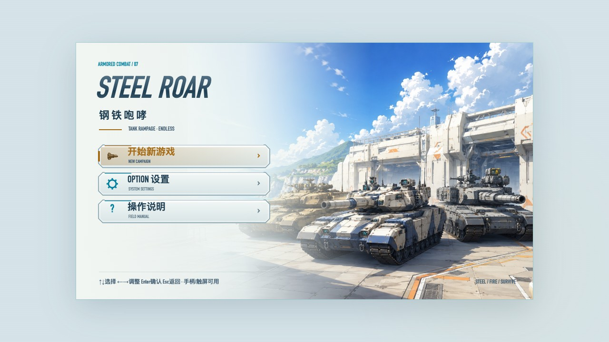

## 这一版更新了什么

- **画面统一**：晴空基地、明亮整备库、七主题地面材质，菜单、帮助与战斗 HUD 同步更新。机体采用分层精灵与连续旋转炮塔，配合底盘厚度、接触影和短残影呈现立体感。
- **三种瞄准方式**：右摇杆关闭时自动瞄准；开启后可选半自动或完全手动。半自动允许随时接管炮塔，松杆约 0.65 秒后恢复追踪。
- **敌军编队**：楔形、横列、双翼轮换，坦克与卡车混合推进、错峰射击，通常每波 3–6 台，配额尾波可能更少。
- **中期精英单挑**：每关中段清场后出现一台深色同款机甲，核心属性取玩家入场时的约 80%，具备机枪、主炮、加速和有限护盾。预警后开战，僚机待命，击破精英后恢复普通编队。
- **整备与结算**：机体、僚机分组培养；左右键或手柄十字键长按连续加减，触屏长按 ± 同样有效。过关掉落继续汇集，快速进入下一页也不会丢失奖励。
- **稳定性修复**：重装机体实心材质、三机体自然残影、障碍通行间距和僚机碰撞修复；BGM/SE 补齐输入及页面恢复，修复重新开局后部分音效失声。

## 界面实拍

以下截图均由 **v1.10.0 实际运行版本**拍摄，战斗场景使用内置调试接口摆放单位以便展示；触屏图为桌面浏览器模拟布局，不是手机性能证明。

| 选择机体 | 选择僚机 |
|---|---|
| 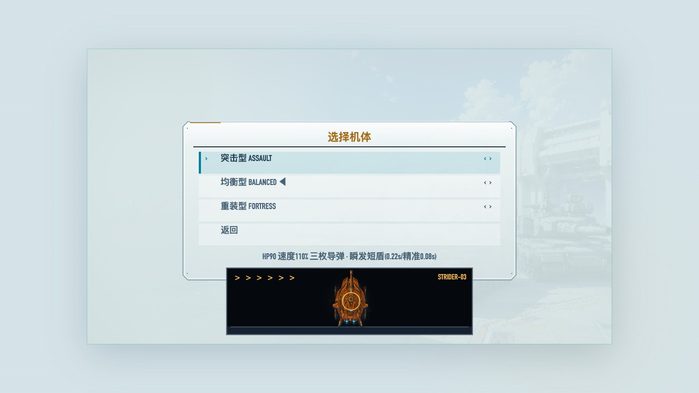 | 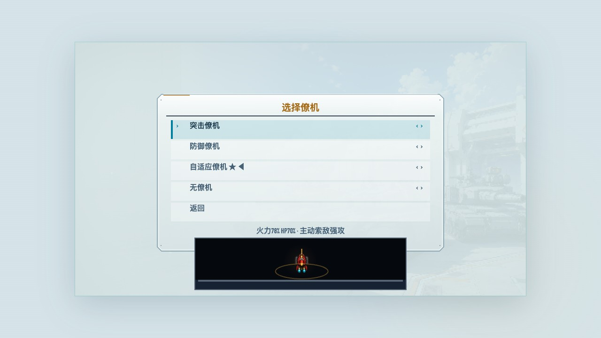 |

| 战地整备 | 设置与音量 |
|---|---|
| 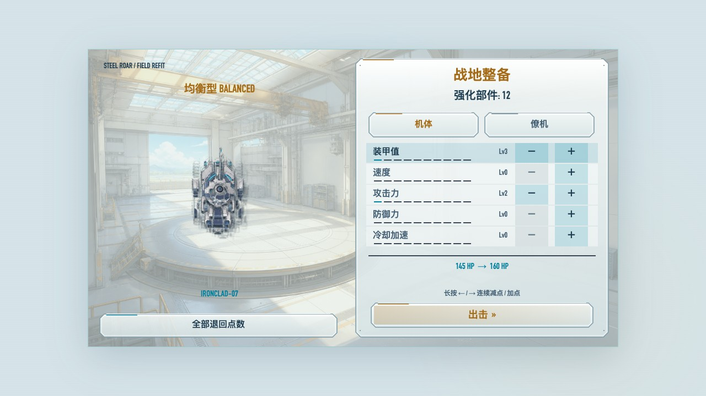 | 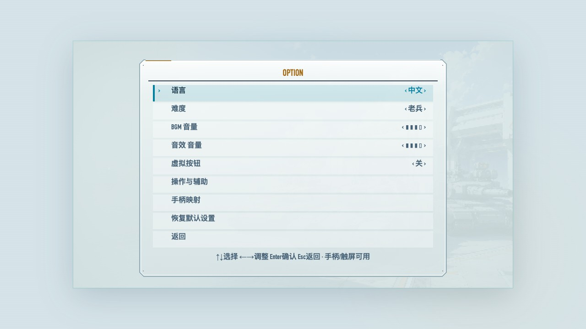 |

| 操作与辅助 | 14 页图文帮助 |
|---|---|
| 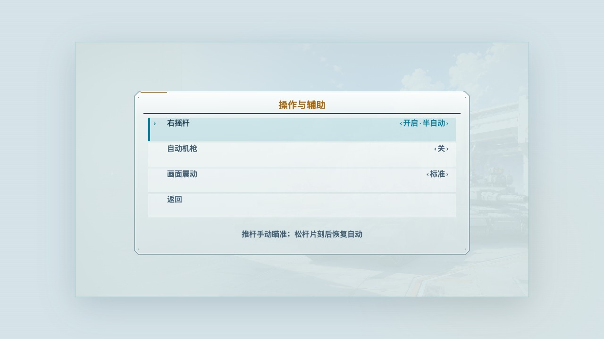 | 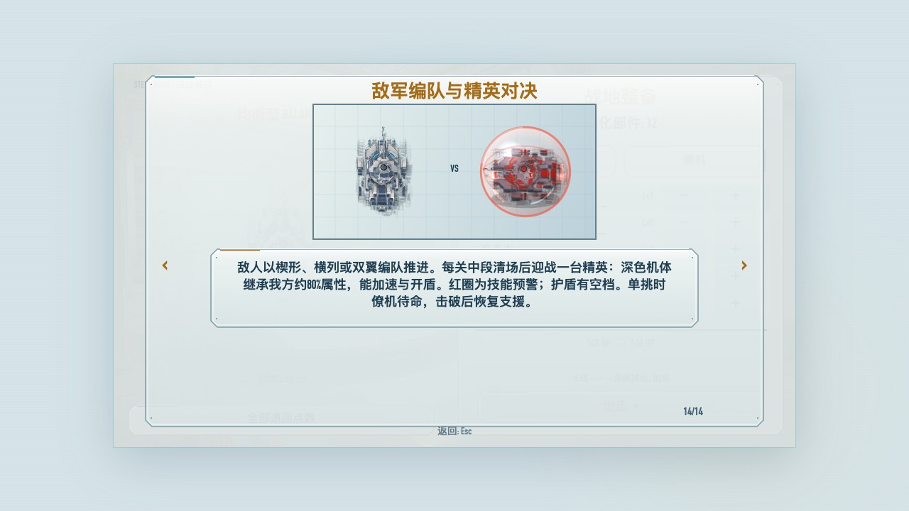 |

| 中期精英对决 | 敌军编队 |
|---|---|
| 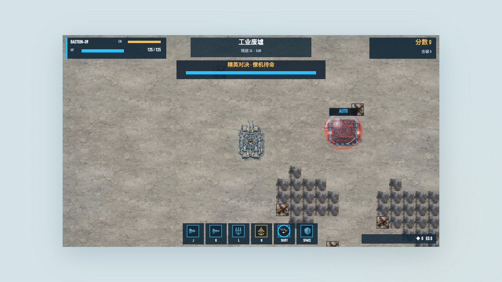 | 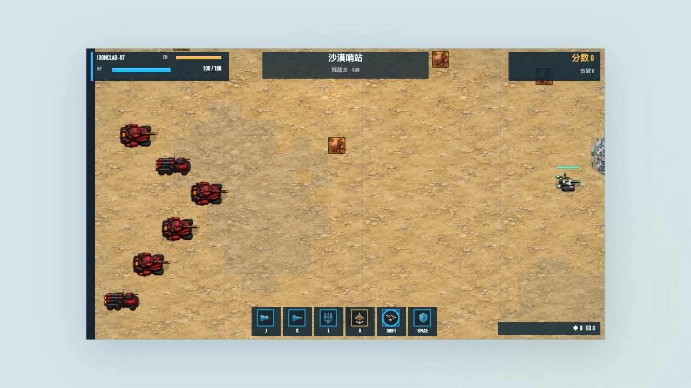 |

| 触屏布局 | 通关与奖励 |
|---|---|
| 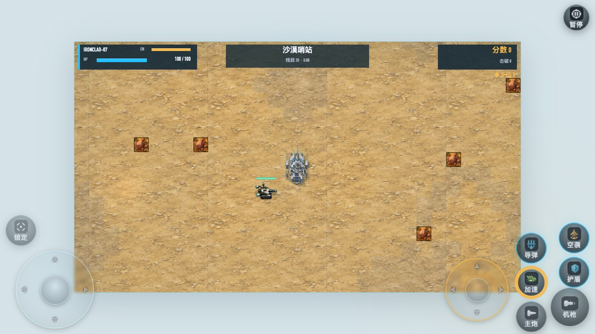 | 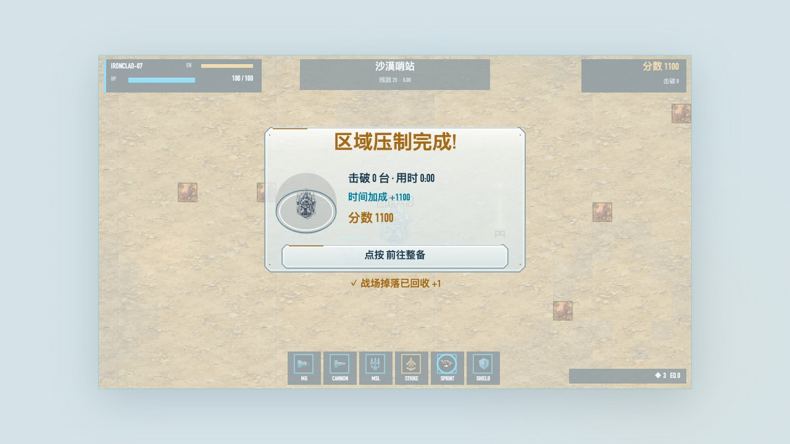 |

## 七个战场

| 沙漠哨站 | 林地圣域 | 雨巷孤城 |
|---|---|---|
| 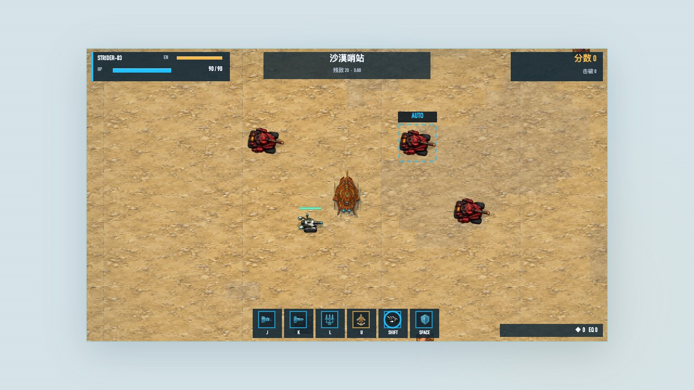 | 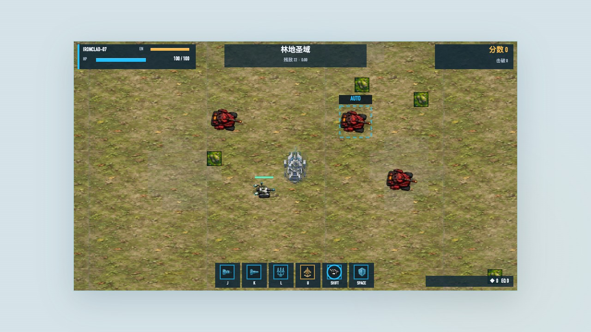 | 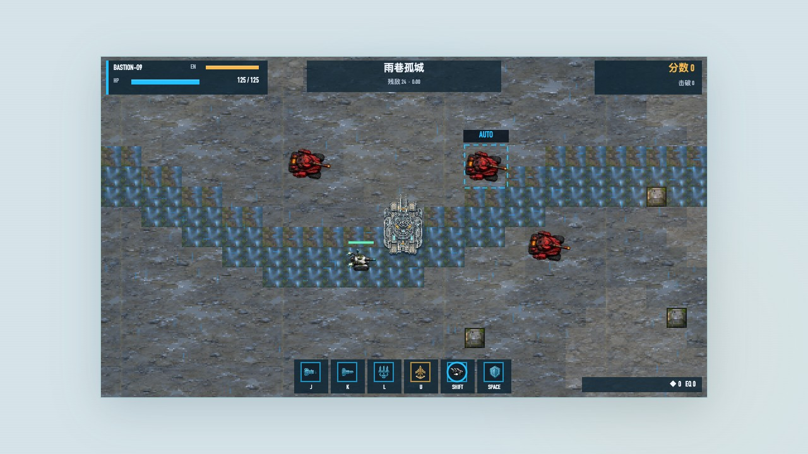 |

| 工业废墟 | 雪原突围 | 夜幕要塞 |
|---|---|---|
| 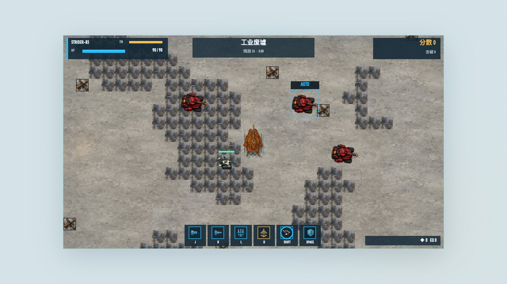 | 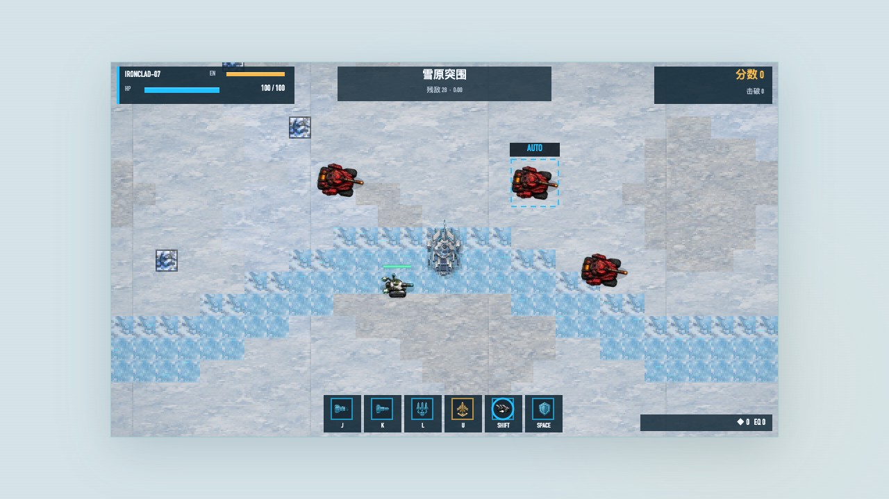 | 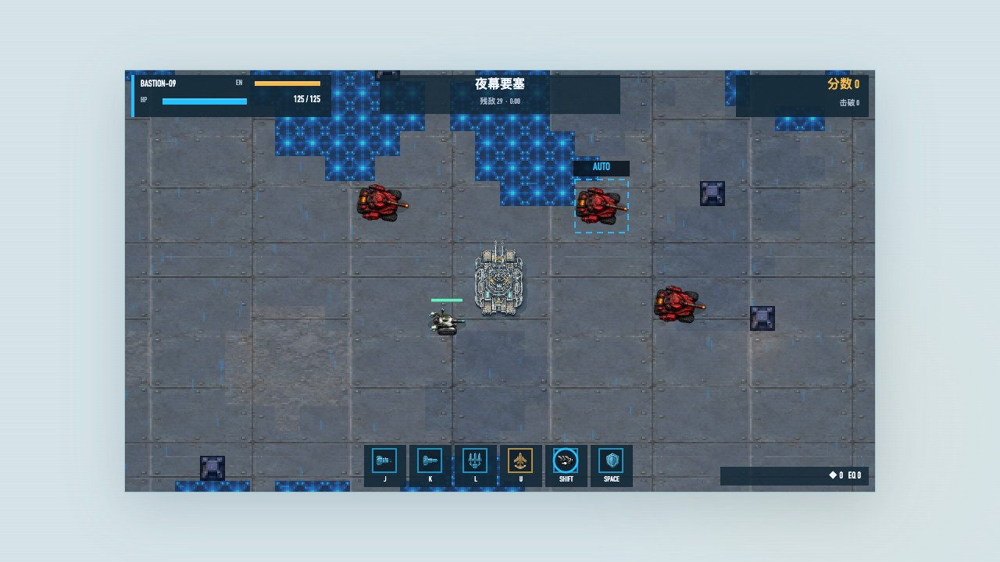 |

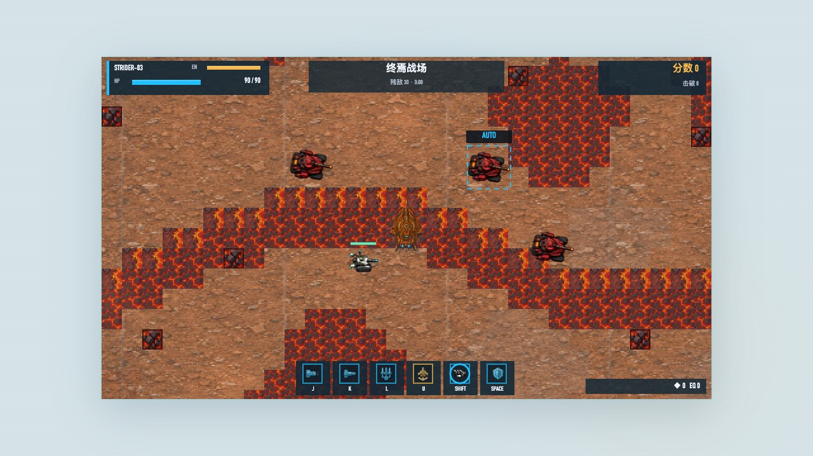

## 操作

| 按键 | 功能 |
|---|---|
| W / A / S / D | 移动 |
| 方向键 | 半自动、手动模式下控制炮塔 |
| I | 自动、半自动时切换锁定目标 |
| J | 机枪，按住连发 |
| K | 主炮 |
| L | 按住蓄力导弹，松开齐射；无目标时沿炮塔方向发射 |
| U | 空袭护航，无有效目标时不消耗冷却 |
| Shift | 涡轮加速与高速冲撞 |
| 空格 | 能量护盾；把握开启时机可弹反 |
| P / Esc | 暂停或返回 |
| Enter | 确认、跳过开场 |
| M | 静音切换 |
| 整备页 ← / →，或 A / D | 减少 / 增加，长按连续调整 |

在**设置 → 操作与辅助**切换右摇杆模式、自动机枪和画面震动。触屏左杆移动，右杆按模式显示，武器按钮自带冷却/蓄力提示。手柄默认 A 机枪、X 主炮、Y 导弹、B 空袭、RB 加速、LB 护盾、R3 锁定、Start 暂停，可在设置中改键。

网页首次使用或系统中断后若尚未出声，请点一下游戏画面或按一个键完成浏览器音频授权。BGM 和 SE 可分别调节；音量为零及 M 静音时保持静音。

## 战斗与成长

- **三机体**：突击偏机动与连锁导弹，均衡兼顾火力和操纵，重装偏生存与冲撞。不同质量、加速、转向和抓地参数带来不同驾驶手感。
- **武器组合**：机枪、范围主炮、最多六枚多锁导弹、护航空袭。炮塔独立转向；导弹与空袭保留各自寻敌逻辑。
- **护盾与冲撞**：开启瞬间弹反、完美格挡反馈、高速撞击、质量分级击飞；冰面、泥地等地形影响驾驶。
- **培养与周目**：机体五维和僚机四维共用强化点数，可退回重分；有效上限后不再扣点。通关后保留装备和累计战果，重选机体/僚机再进入下一周目。
- **难度**：五档可选；中期精英只复制上述核心属性与技能，不拥有玩家全部武器能力，护盾有预警和空窗，不是永久无敌。

## 下载与存档

- **Android**：从 [v1.10.0 Release](https://github.com/rance1230/steel-roar-tank-battle/releases/tag/v1.10.0) 下载正式签名 APK，Android 7.0+，横屏游玩。正式包名 `com.rance.steelroar`，与旧正式版同签名可覆盖安装。
- **桌面**：下载 `index.html`，用现代浏览器打开；或直接使用在线版。源代码开发入口是 `index.dev.html`。
- **存档**：本地保存，兼容旧存档迁移。网页版、下载文件版、Android 正式版与调试版各自保存，不自动跨设备同步。卸载应用或清除浏览器站点数据会丢失对应存档。

## 本机验证

v1.10.0 发布检查覆盖：键盘与触屏输入、三种瞄准模式、手柄模拟输入、三语菜单、七主题渲染、210 张随机地图通行、七关编队/精英/Boss 流程、清关奖励、旧存档迁移和音频输出恢复。

音频用真实浏览器 AudioContext 与输出采样验证；手柄用浏览器接口模拟。**本轮未连接手机或实体手柄，锁屏、电话中断、蓝牙切换和设备听音尚未实机验收。**桌面有限场景检查不代表所有设备无问题。

## 开发与复测

需要 Node.js 和 Chromium。测试工具依赖固定版本 `playwright-core`：

```sh
npm ci
npx playwright-core install chromium
npm run build
npm test
npm run screenshots
```

使用已有 Chrome 时，设置 `CHROME_PATH` 为可执行文件路径；`GAME_URL` 可指定要测的部署页面。测试输出写入 `output/`，截图写入 `docs/img/v1.10.0/`。

Android 使用 JDK 21 和 Android SDK：

```sh
npm run build
cp index.html android/app/src/main/assets/index.html
cd android
./gradlew assembleDebug
```

正式发布使用已有签名配置构建 `assembleRelease`，并检查版本、证书以及 APK 内 `assets/index.html` 与仓库生成文件的一致性。签名材料不入库。

`src/` 为 Canvas 游戏模块，`node build.js` 按入口顺序内联脚本。底盘为 16 向图集，炮塔连续旋转；地面材质缓存，逻辑固定 60Hz。`tools/assemble_v22_art.js` 根据 `assets/ai-v22-ui/` 的 JPEG 重建日光素材数据。推送 `main` 自动部署 GitHub Pages，APK 和单文件网页通过 Release 分发。

旧版图文指南保留作历史资料；当前操作以本页和游戏内 14 页帮助为准。
