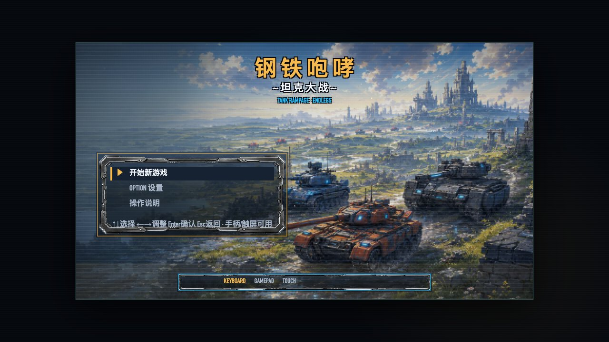
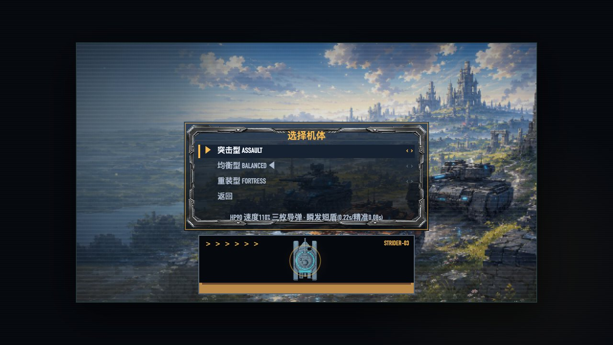
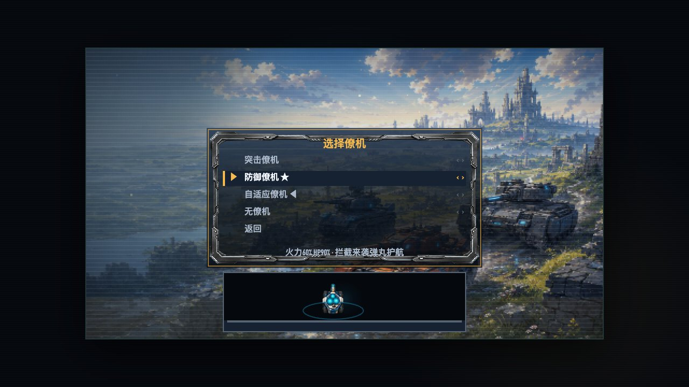
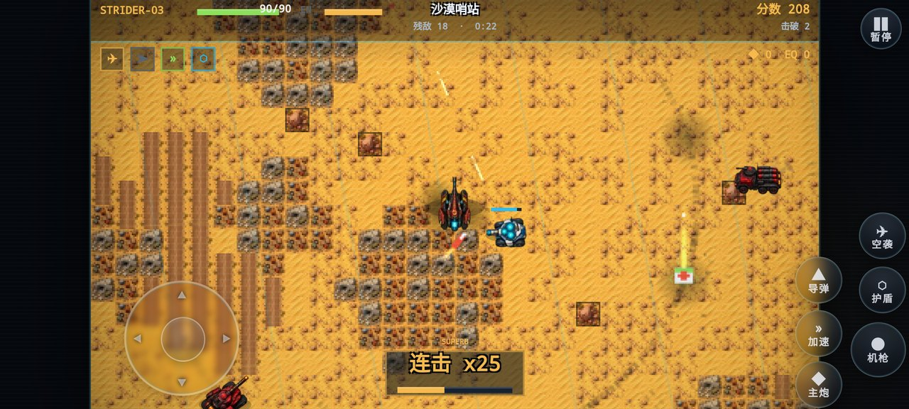
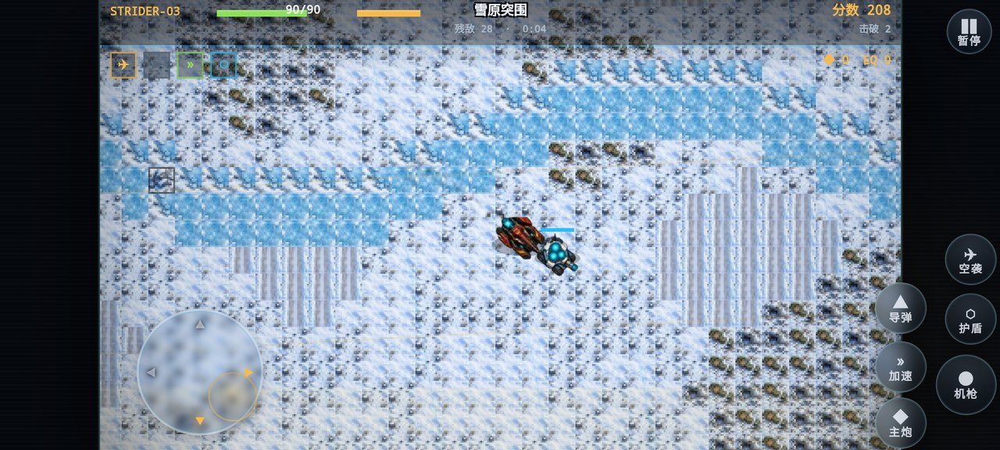
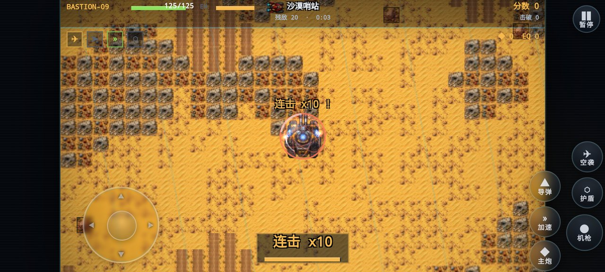
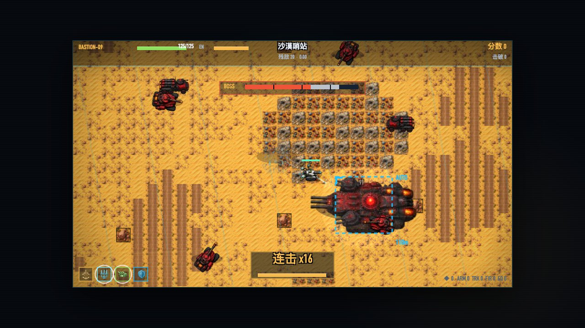
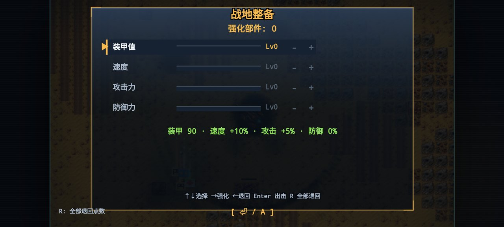
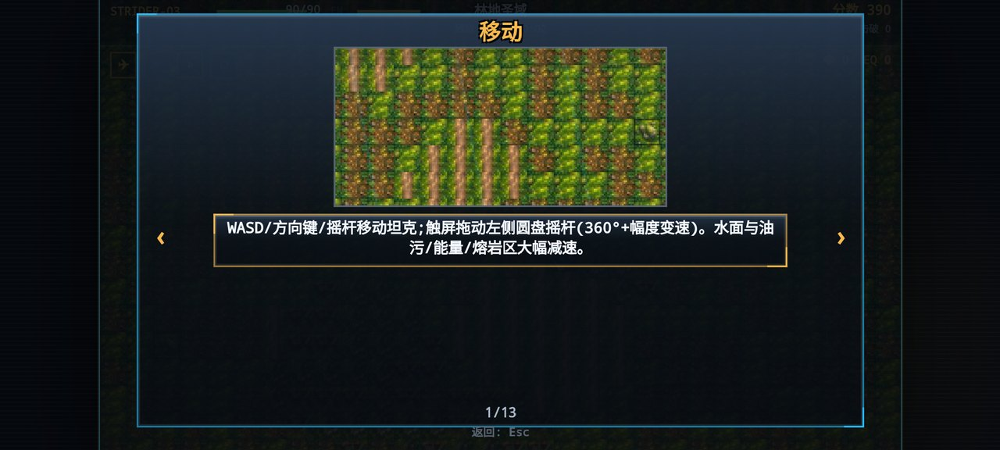

# 钢铁咆哮·坦克大战（Steel Roar · Tank Rampage）

横版坦克突击动作游戏：驾驶孤军坦克穿越**七大主题战场**，击破敌军、捡强化部件、弹反敌弹、轰穿 BOSS 与它的精英护卫队——通关后进入更高强度的下一周目，无限循环。

**当前版本 v1.7.0**（内容里程碑：v14 高清 AI 立绘 → v15 俯视 16 向单位 + 地形图集 → v1.5 七主题关卡与玻璃 UI → v1.6 机动特效与 BOSS 护卫队 → v1.7 手感三改：震动分级 · 实心冲刺残影 · 3D 等离子护罩 · 地形特效增强）

- ▶ 在线游玩（GitHub Pages）：https://rance1230.github.io/steel-roar-tank-battle/
- 📦 Android APK / 单文件 `index.html`：[GitHub Releases](https://github.com/rance1230/steel-roar-tank-battle/releases)
- 💻 桌面端：双击 `index.html` 即玩（Chrome / Edge / Firefox / Safari）

---

## 游戏截图

| 标题画面 | 选择机体（实车预览） | 选择僚机 |
|---|---|---|
|  |  |  |

| 沙漠哨站·战斗（模拟摇杆+玻璃按键） | 雪原突围·主题战场 | 3D 等离子护罩 |
|---|---|---|
|  |  |  |

| BOSS 与精英护卫队 | 战地整备（局内成长） | 内置操作说明（13 页） |
|---|---|---|
|  |  |  |

---

## 核心特色

- **七大主题战场**：沙漠哨站 → 林地圣域 → 雨巷孤城 → 工业废墟 → 雪原突围 → 夜幕要塞 → 终焉战场。每关专属调色、环境粒子、v15 地形图集瓦片，以及主题化减速地形（油污 / 能量地板 / 熔岩裂隙）。
- **高清 AI 立绘单位**：我方三机体、僚机、敌军与 BOSS 陆舰均为正交俯视 16 方向精绘 sprite，平滑转向、阵营辉光、受击闪白。
- **四种武器**：机枪连发 / 主炮范围爆炸 / 蓄力追踪导弹（突击型三枚分锁）/ 空袭轰炸。
- **护盾弹反**：受击瞬间开启可完全无伤并把敌弹反弹回去；完美格挡（≤0.12s）伤害更强、顿帧保连击。
- **冲撞破门**：高速冲撞触发零距离炮击 ×1.35，按敌质量击飞、撞飞连锁（深度≤3）。
- **连击与 Overdrive**：5 秒连击链，连击越高掉落越好，60+ 进入 Overdrive（射速/移速提升+金色尾焰）。
- **BOSS 精英护卫队**：BOSS 不再单挑——4+ 精英随行环布合围，BOSS 冲锋前有「!!」预警，击破 BOSS 护卫溃散。
- **v1.7 手感三改**：3D 等离子护罩（球面明暗+经纬弧线+环绕能量点，三机体尺寸各异）；震动分级（命中轻震、击破重震、BOSS 击破延长）；冲刺拖出 3 条按车身距回溯的实心剪影；水面涟漪/冰面碎晶/熔岩余烬等地形特效全面增强。
- **机动表现**：触屏模拟摇杆 360° 变速、冲刺残影、按地形出扬尘/水花/减速粒子。
- **Roguelite 成长**：每关后「战地整备」用部件升级装甲/速度/攻击/防御（可全额退回重分），通关进入下一周目，强化全部继承。
- **玻璃拟态 UI**：标题/菜单/整备/结算全套玻璃面板，虚拟按键为圆形玻璃按钮 + 摇杆圆环。
- 中 / 日 / 英三语 · 5 档难度 · 键盘/触屏/手柄三种操作（手柄即插即用，可自定义映射）· 13 页内置图文帮助。

## 快速上手（键盘）

| 按键 | 功能 |
|---|---|
| W A S D / 方向键 | 移动 |
| J | 机枪（按住连发） |
| K | 主炮（范围爆炸） |
| L | 蓄力导弹（按住蓄力，松开追踪发射） |
| U | 空袭轰炸（冷却 5 秒） |
| Shift | 涡轮加速（高速冲撞的前提） |
| 空格 | 能量护盾（受击瞬间开启=弹反） |
| P / Esc | 暂停 |
| Enter | 确认 / 跳过开场 |
| M | 静音 · F3 性能面板 |

触屏：自动显示虚拟摇杆与圆形玻璃按键；手柄：即插即用，OPTION→手柄映射可自定义。安卓返回键按两次退出。

## 文档

- [游戏介绍与操作说明](output/android/游戏说明书/游戏介绍与操作说明.md) — 三模式操作详解、核心系统、七关图鉴、HUD 图解
- [页面与按钮导览](output/android/页面导览/页面与按钮导览.md) — 按页面·按钮·路径的图文导览（实机逐项实测）
- [Android 安装与构建](output/android/README-安装与构建.md)
- [v14 立绘验收报告](output/android/v14立绘验收报告.md) · [功能基线 BASELINE](BASELINE.md) · [CHANGELOG](CHANGELOG_vNext.md)

## 开发

- **架构**：`src/` 模块化源码（开发用 `index.dev.html`），`node build.js` 构建单文件 `index.html`；逻辑固定 60Hz 与刷新率解耦，渲染插值 + 对象池 + 空间网格，性能不足时 AUTO 档只降特效不降逻辑。
- **资产管线**：`tools/`（Python）装配 AI 立绘/地形/开场图 → 内嵌数据文件（`src/data/*.data.js`）；`assets/ai-v14/`、`assets/ai-v15-topdown/`、`assets/stage-intros/`。
- **部署**：推送 `main` 自动发布 GitHub Pages；APK 与单文件随 [GitHub Releases](https://github.com/rance1230/steel-roar-tank-battle/releases) 发布。
