# 🖼️ Sprite Sheet Maker

[](https://extensions.blender.org/add-ons/sprite-sheet-maker/)


A blender addon to convert your 3D animations into 2D sprite sheets with in-built toggleable pixelation

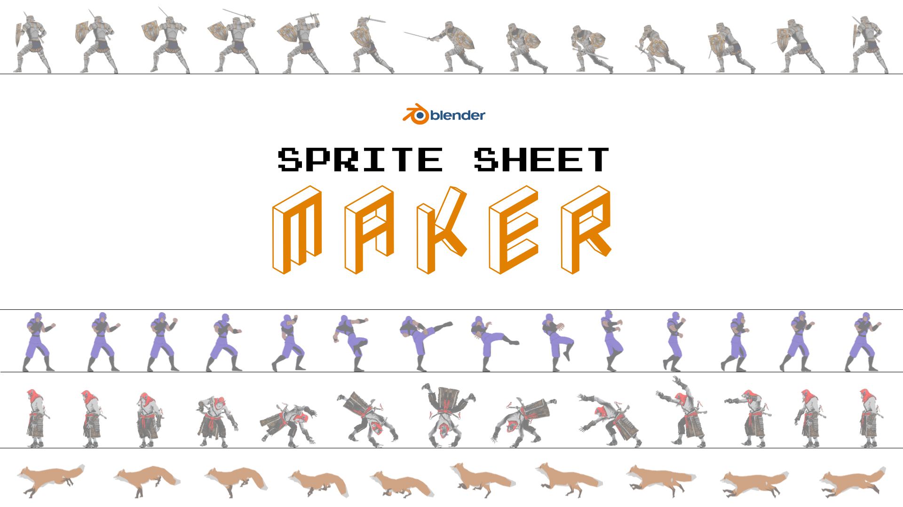


## 🪄 Features
1. Highly customizable
1. Inbuilt auto camera
1. Labeling for each row
1. Allows single sprite creation
1. In-built pixelation tool
1. Options for combining into sheet, strips or images
1. Maintains sprite dimension consistency
1. Recontinuing in case of failure  
1. Supports perspective & orthographic camera
1. Import/Export settings

>📜 **Tip:**  
> If you want to reuse the core functionality without the UI in your own code base look inside the `modules/` folder.  
>
> _If you use these in your own project, attribution is appreciated! Also feel free to leave a ⭐_


## 🌟 Showcase
<details>
<summary>View Images</summary>

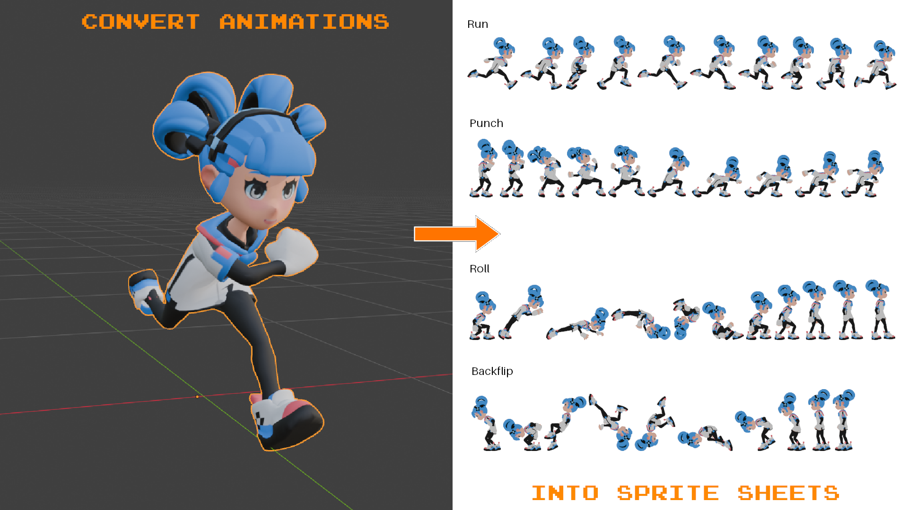  
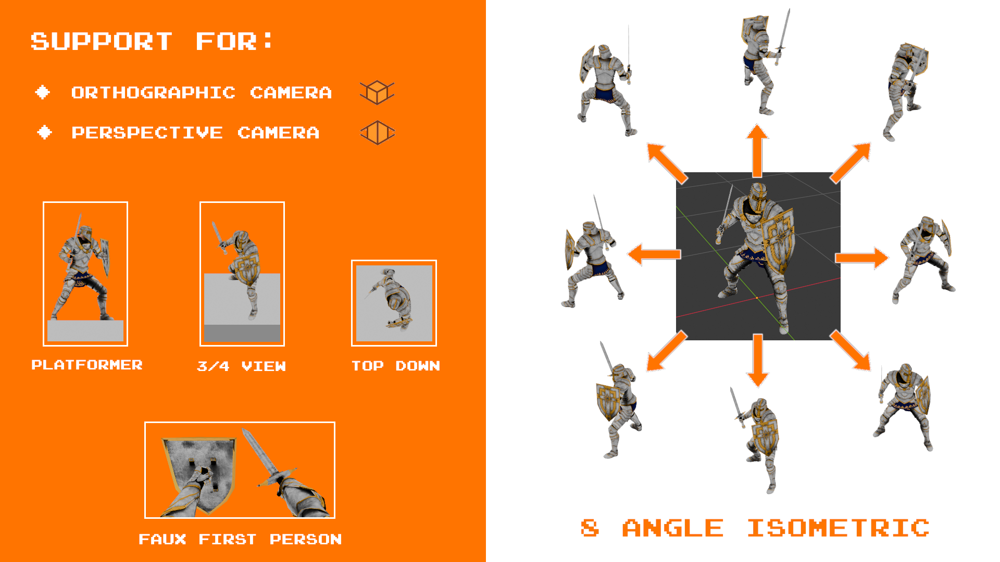  
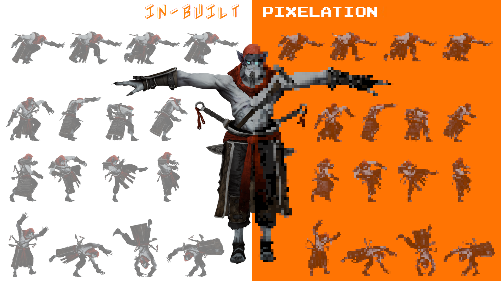  
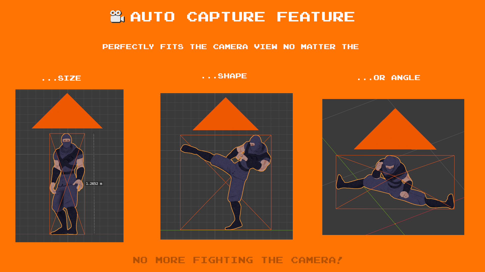  
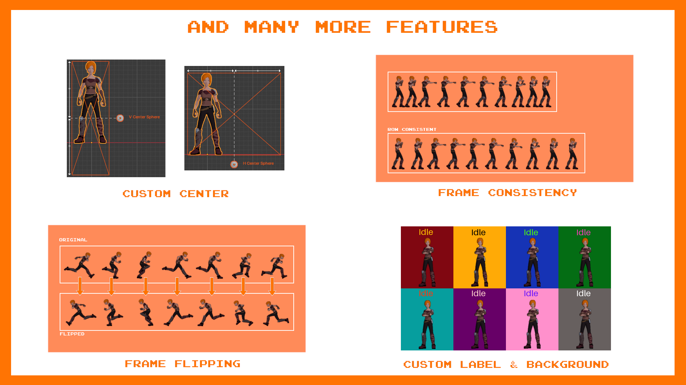  

</details>


## 🛠️ How to install?
1. Download the addon from [releases](https://github.com/ManasMakde/SpriteSheetMaker/releases/) or official [blender extension](https://extensions.blender.org/add-ons/sprite-sheet-maker/) site
2. If installed from releases, Go to _Edit -> Preferences -> Add-ons -> Install from Disk_ and select the .zip file (make sure it's enabled once installed)
3. If the installation was successful you should now see the panel as such:  
   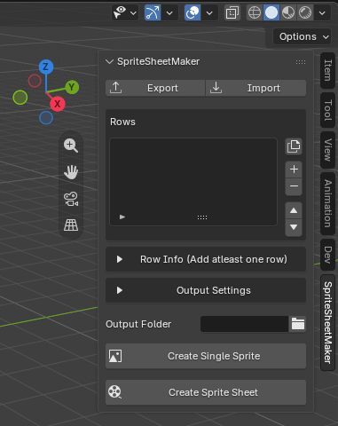  


## 📖 Terminology  
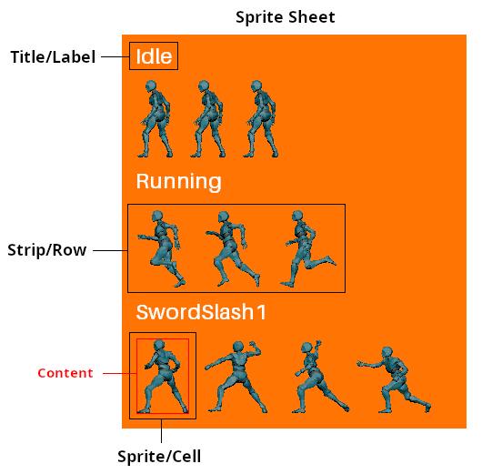  
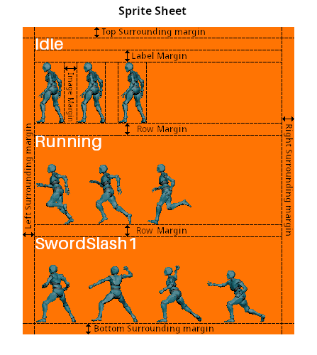  


## 🧭 Usage

1. **Export/Import:**  
   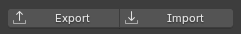

   You can use these buttons to export or import your current addon values for future reusability.  
   The values are saved as `.json` file and hence they can also be modified externally.


1. **Rows:**   
   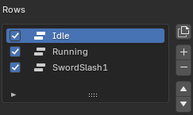   

   Each one of these represent a row within a sprite sheet.  
   You can enable/disable them by using the  button. (Disabled rows won't show up in the sheet)  
   You can duplicate them by using the 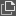 button on the side.  
   You can add or remove them using the + and - buttons on the side.  
   You can reorder them using the arrow ▲ and ▼ buttons on the side.

   > **Note:**  
   > 1. The order of rows in this list corresponds to the order in which they appear in the sprite sheet.
   > 2. You can hold Alt and enable/disable any row the changes will sync across all other rows.


1. **Row Info:**  
   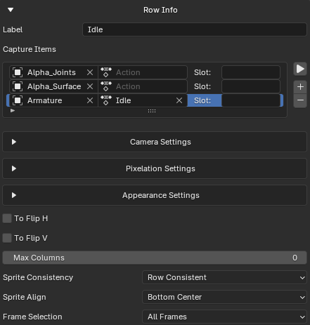   

   This shows the properties of whichever row is **selected** in `Rows`, If it is grayed out & disabled then it mean you have to add a row first.
   
   You can preview all the actions to be rendered in this row by pressing ▶︎ button.
   
   > **Note:**  
   > You can hold Alt and change any of the Row Info properties (except `Label` & `Capture Items`) to sync changes across all rows.

   -  **Label:**  
      This is the text that will be added on top of the row in the sprite sheet.

   - **Capture Items:**  
      These are all the objects that will be captured within a single row, Use + and - buttons on the side to add & remove items. Once an item is created it will have 3 inputs:  
      `Object`: This refers to the object that should be captured  
      `Action`: This refers to what action the aforementioned object should be playing  
      `Slot`: This refers to [action slot](https://www.youtube.com/watch?v=N4GlTIz66EA) to be used (leave blank if you're unsure)  

      > **Note:**  
      > If the Label is empty and an action is assgined then the Label will automatically be set to the action name.  
      > As long as the Label matches the action name both will remain in sync.  
      > If you don't want this behaviour then simply add an empty space " " at the end of the Label.  
      
   - **To Flip H:**  
      Horizontally flips the rendered image before saving into temp folder.  

   - **To Flip V:**  
      Vertically flips the rendered image before saving into temp folder.  
   
   - **Max Columns:**  
      How many sprites in a row before they wrap down to next sub row. Keep at 0 if no wrapping required.
   
   - **Sprite Consistency:**  
      This dictates what the dimensions of the sprites should be with respect to other sprites.    
      `Individual Consistent`: Every sprite keeps to its own content's width while matching the height of its row i.e. All sprites have their own dimensions.  
      `Row Consistent`: Every sprite in the row matches the row's widest sprite in width and tallest sprite in height i.e. All sprites in a row have the same dimensions.  
      `All Consistent`: Every sprite in the sheet matches the widest sprite in width and tallest sprite in height i.e. All sprites have the same dimensions.  
   
   - **Sprite Align:**  
      Decides how the content should be aligned within the sprite cell.
   
   - **Frame Selection:**  
      Determines which frames are to be rendered  
      `All Frames`: The start & end frame of longest duration action will be taken.  
      `Custom Range`: You can manually set the `Start` & `End` frames (inclusive) to capture in the row.  
      `Custom Count`: All actions will have their number of frames scaled up/down to match `Count`.


1. **Camera Settings:**  
   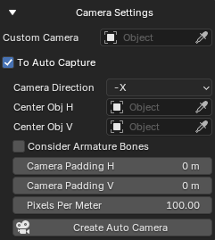   

   - **Custom Camera:**  
      If provided, this camera will be used to capture images

   - **To Auto Capture**  
      If enabled and `Custom Camera` is provided then it will be used, If not provided a new camera will be created and will later be deleted after the sprite sheet is created.  

      Basically "Auto Capture" modifies the camera automatically such that the bounding box of all capture item objects are perfectly encapsulated within the camera view for each frame of the animation. 

   - **Camera Direction:**  
      From which direction should the camera be capturing images.  
      Available options: `x`, `y`, `z`, `-x`, `-y`, `-z`, `Custom`  
      Incase `Custom` is selected 3 more inputs will show up.  

      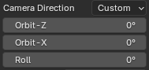  
      **Orbit-Z:** The orbiting z rotation around all capture items.  
      **Orbit-X:** The orbiting x rotation around all capture items.  
      **Roll:**  The [roll][Roll Wiki] rotation of the camera itself.

   - **Center Obj H:**  
      If assigned, This object's origin will always be in the horizontal center of the camera view.  
      If assigned an armature & valid **Bone** is provided then the location of the bone head will be used. Incase of an invalid bone the location of the armature will be used.
   
   - **Center Obj V:**  
      If assigned, This object's origin will always be in the vertical center of the camera view.  

   - **Consider Armature Bones:** If disabled, the bounding box of the armature will ignored during "Auto Capture" (This feature was added so you can avoid pesky leaf bones from being captured).
  
   - **Camera Padding H:**  
      Amount of horizontal padding surrounding the view of the camera.
   
   - **Camera Padding V:**  
      Amount of vertical padding surrounding the view of the camera.
   
   - **Pixels Per Meter:**  
      How many pixels each meter translates to in your sprite sheet.  
      (Don't use this for pixelation, instead use `Pixelation Amount`)

   - **Create Auto Camera:**  
      This will create a camera with the auto capture properties applied to it.  
      If `Custom Camera` is assigned then it will apply the auto capture properties to it instead of creating a new camera.


1. **Pixelation Settings:**  
   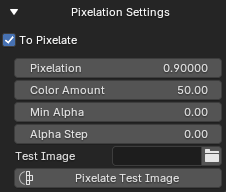   

   - **To Pixelate:**  
      These settings will only show up when check box is enabled.  
      If enabled then the sprites of this row will be pixelated.  

   - **Pixelation:**  
      By how much to pixelate the sprites, Higher the value the more the sprites will be pixelated.

   - **Color Amount:**   
      This controls the "Value" in HSV color of the sprite.

   - **Min Alpha:**  
      If any pixel in the sprite has a transparency less than this amount then it is discarded (If you would like to remove all semi-transparent pixel set this to 1.0).

   - **Alpha Step:**  
      Ensures that all pixels have a transparency which is a multiple of this amount, Keep at 0.0 to disable.

   - **Test Image:**  
      Provide an image on which to apply the pixelation settings (useful for testing pixelation settings before applying to entire sheet).

   - **Pixelate Test Image:**  
      Generates a pixelated version of the test image provided. This is purely for testing purposes on the provided image, this button will not effect your sprite sheet in any way (You can also think of this as a standalone pixelizer for images).

   > **Note:**  
   > If the pixelated sprite quality is improper, Try increasing the `Pixels Per Meter` and trying again. 


1. **Appearance Settings:**  
   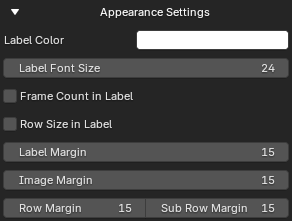   

   - **Label Color:**  
      The color of the label on top of the row.

   - **Label Font Size:**  
      The font size of the action name labels in sprite sheet, If you do not want labels in your sprite sheet you can set it to 0.  

   - **Frame Count in Label:**  
      If enabled, The number of frames will be added into the label of each row.

   - **Row Size in Label:**  
      If enabled, The width & height will be added into the label of each row.  
      `Image Margin` will be taken into account but not `Surrounding Margings`.

   - **Label Margin:**  
      Vertical margin, in pixels, between the label and the images.  
      
   - **Image Margin:**  
      Horizonal margin, in pixel, between images within a row.  
   
   - **Row Margin:**  
      Vertical margin, in pixels, between 2 rows.
   
   - **Sub Row Margin:**  
      Vertical margin, in pixels, between 2 sub rows caused by `Max Columns`.


1. **Output Settings:**  
   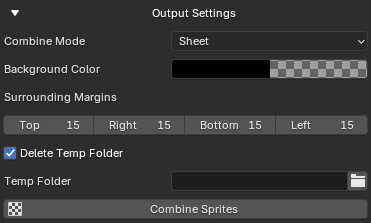   

   - **Combine Mode:**  
      `Images`: Creates all sprites in separate files.  
      `Strips`: Creates each row as a seperate file.   
      `Sheet`: Creates a complete sprite sheet as a single file.  

   - **Background Color:**  
      The background color of the entire sprite sheet. (Can also be set to transparent)

   - **Surrounding Margins:**  
      Margin, in pixels, that should be applied around the borders of the entire sprite sheet.  

   - **Delete Temp Folder:**  
      If enabled, The temporary folder is deleted after creating the sprite sheet.  

   - **Temp Folder:**  
      Used as input for `Combine Sprites` button.

   - **Combine Sprites:**  
      Combines all images in the selected `Temp Folder` into one sprite sheet but only given that it follows the following structure:

      ```
      SpriteSheetMakerTemp/
      ├── 0_Idle/
      │   ├── 1.png
      │   └── 2.png
      ├── 1_Running/
      │   ├── 1.png
      │   └── 2.png
      └── 2_Attacking/
         ├── 1.png
         └── 2.png
      ```

> **⚠️ Warning:**  
> Do not use NLA while using this addon it will cause unexpected behaviour instead just bake multiple actions together into a single action. Look [here](#why-not-use-nla-question) for more info.


## 🗺️ Example
<details>
<summary><b>Creating your first sprite sheet</b></summary>

1. Get your mesh & animations from [mixamo](https://www.mixamo.com/) or [mesh2motion](https://mesh2motion.org/).  
   For this example we will be using `Mannequin` Mesh & `Idle Loop`, `Walk Loop`, `Puch Cross` animations from mesh2motion.  

1. Import into blender and rename the mesh & armature accordingly:  
   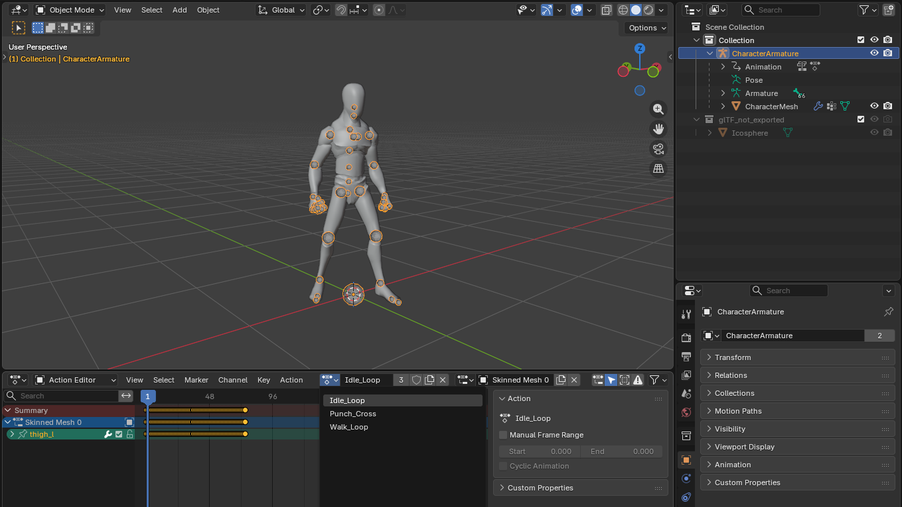

1. Setup your _Render Properties_, You can adjust these as needed but for this example we're using:   
   Set _Render Engine_ to `Workbench`  
   Set _Lighting_ to `Studio` & _Studiolight_ to `paint.sl`  
   Set _Object Color_ to `Texture`  
   Enable _Transparent_    
   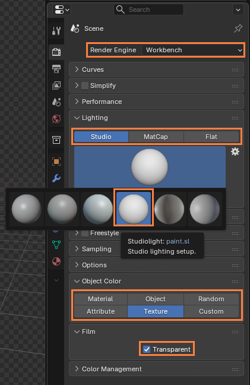  
   
1. Open the addon and create a new row by clicking on the + button  
   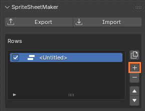  
   This now represents a single row in your sprite sheet.  

1. Now in the _Row Info_ add 2 capture items by pressing on the + button  
   Then in one of the items assign the object as the mesh  
   Then in the other item assign the object as the armature & the action as `Idle_Loop`  
   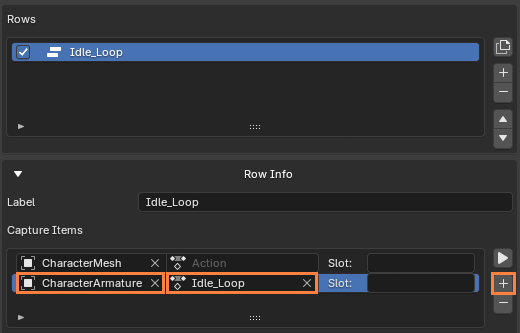

   > **Note:** Do not assign the action to the mesh it won't work.

1. Now repeat the process and create 2 more rows each for animations `Walk_Loop` & `Punch_Cross`.  
   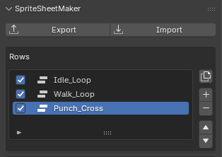

1. Set the output folder (Any location is fine, For this example we'll be using Desktop)  
   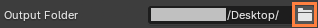

1. Click on `Create Sprite Sheet` Button & Voilà you've just created your first sprite sheet!  
   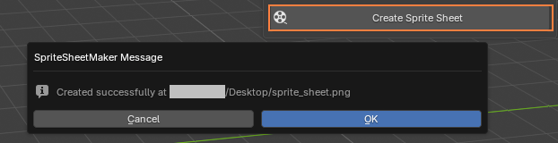

If you followed all the steps your sprite sheet should look something like this:
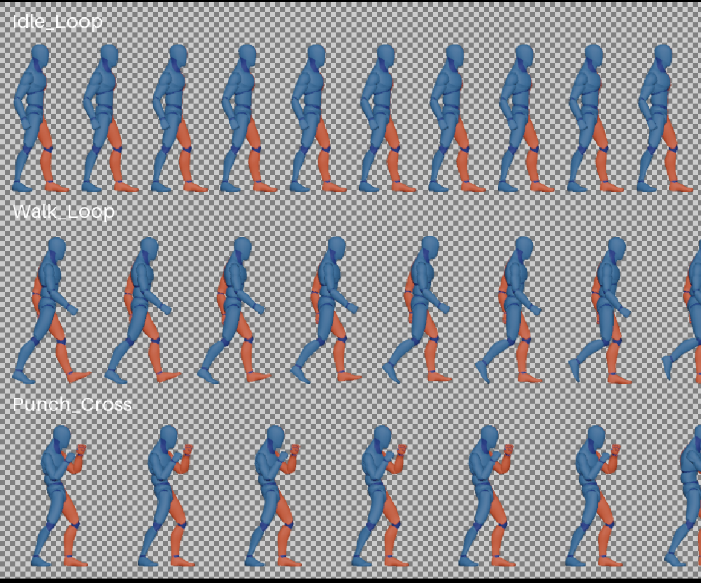

</details>


## ❓ Common Questions

<details><summary><b><i>Why is my sprite empty / not showing any objects?</i></b></summary>

   1. Make sure you've added the desired objects to `Objects to Capture`.
   2. Make sure `Pixels Per Meter` isn't 0 or too small.
   3. Make sure if `To Auto Capture` is unchecked your own camera is setup properly.
   4. Make sure `Pixelation Amount` isn't too much.
   5. Make sure `Min Alpha` & `Alpha step` aren't exceeding 1.0.
   6. Make sure you've added lights.
   7. Try rendering on your own before using this addon to see if the issue persists.
</details>

<details><summary><b><i>Why do strips contain the same or invalid animation?</i></b></summary>

   Make sure you have assigned the correct actions & slots in "Capture Items" for all strips.
</details>

<details><summary><b><i>Why is my content improperly cut off?</i></b></summary>

   Make sure you have assigned the correct objects in "Capture Items" for all strips.
</details>

<details><summary><b><i>Why is "Create Single Sprite" changing the poses of objects & armatures?</i></b></summary>

   This is not an addon issue it's just how Blender works while rendering, Try unlinking the actions from the objects & armatures first then create the single sprite.
</details>

<details><summary><b><i>Why is Blender crashing when I try to create a sprite sheet?</i></b></summary>

   1. You might be trying to render an image that is too big i.e. the value of `Pixels Per Meter` is too high or you're trying to capture a really big object with too much resolution, Try rendering without the addon first to see if the issue still persists.
   2. You might be trying to render too many frames and your system might not be able to handle it.
</details>

<details><summary><b><i>How do I see the progress of sprite sheet creation?</i></b></summary>

   You need to open Blender via [console](https://www.youtube.com/watch?v=ijngHwCoDQo) where you can see exactly what the addon is currently doing.
</details>

<details><summary><b><i>Why isn't the background transparent?</i></b></summary>

   1. This is not a addon issue, you have to manually set it in `Render Properties > Film > Transparent` and enable it as shown [here](https://www.youtube.com/watch?v=kgqvS69_X98).
   2. Make sure Output `Properties > Color` is set to RGBA & that `File Format` is .png.
</details>

<details><summary><b><i>How to recontinue interrupted rendering of sprite sheet?</i></b></summary>

   1. Locate the incomplete "SpriteMakerTemp" folder (or whichever folder you were rendering your sprite frames into) and see which actions have not rendered all frames or are missing.
   2. Then add those missing/incomplete actions to `Actions to Capture` and uncheck the `Delete Temp Folder` and creating a spritesheet (to get a new "SpriteMakerTemp").
   3. Merge the old and new "SpriteMakerTemp" folders together according to the structure mentioned in "How this works?".
   4. Then use the `Combine Sprites` button to get a complete spritesheet.
</details>

<details><summary><b><i>Why do my objects not perfectly fit into camera view (especially perspective) when creating auto camera?</i></b></summary>

   1. Make sure the desired objects are added into the capture items list.
   2. The auto camera perfectly fits the **bounding box** into the view not the object vertices themselves since that would be computationally very expensive. To check this yourself [turn on the bounding box](https://www.youtube.com/watch?v=uL1goLLdIWw).
</details>

<details id="why-not-use-nla-question" ><summary><b><i>Why does using NLA cause unexpected behaviours?</i></b></summary>

   Blender has no feature to organize NLAs into reusable structures like an "NLA library" and therefore the addon has no way to know which NLA belongs to which row in the sprite sheet.  
   
   The addon simply mutes all NLA tracks before rendering but depending on where your "current frame" was in the timeline before rendering the sprite sheet the NLA effects may persist causing inconsistent animations.  

   This is a blender shortcoming not an addon bug.
</details>

<br/>

> **Note:**  
> Remember this is just a tool to help with your workflow and if you want to make really good art I recommend you also paint over the spritesheet yourself 🙂


## 👨‍💻 Development

1. Clone this repo
   ```
   git clone https://github.com/ManasMakde/SpriteSheetMaker
   ```
2. Switch to whichever branch you want to modify
   ```
   git switch <branch-name>
   ```
3. (Optional) Install [Blender Development Plugin](https://marketplace.visualstudio.com/items?itemName=JacquesLucke.blender-development) to ease workflow

4. After you're done making changes, Build the zip files with the following command
   ```
   python build.py
   ```
5. (For maintainer only) Upload all generated .zip files separately one by one to https://extensions.blender.org/

> **Note:**  
> Do not upload all zip files all at once it does not work


## 🤝 Contribution
You can contribute in the following ways:
1. Report bugs or suggest features by opening a [new issue](https://github.com/ManasMakde/SpriteSheetMaker/issues/new).
2. Write test cases.
3. Sponsor this project.


## ❤️ Sponsor
If this addons has been useful in your projects consider [supporting][Sponsor] its development.  
Any support motivates to keep the project well maintained, documented & growing.


## 🏆 Credits
1. [Default Cube YouTube - I Am A Pixel Art Master](https://www.youtube.com/watch?v=AQcovwUHMf0)


## 🔑 License  
MIT © [Manas Ravindra Makde](https://manasmakde.github.io/)


[Roll Wiki]: https://simple.wikipedia.org/wiki/Pitch,_yaw,_and_roll
[Sponsor]: https://github.com/sponsors/ManasMakde
