# 钢铁咆哮 · 坦克大战 — 游戏介绍与操作说明

> 七关连续战役 · 单人坦克突击动作游戏 · Android / PC 浏览器双平台
> 版本 v1.3 · 包名 `com.rance.steelroar` · APK 约 24.4MB · 简体中文 / English / 日本語

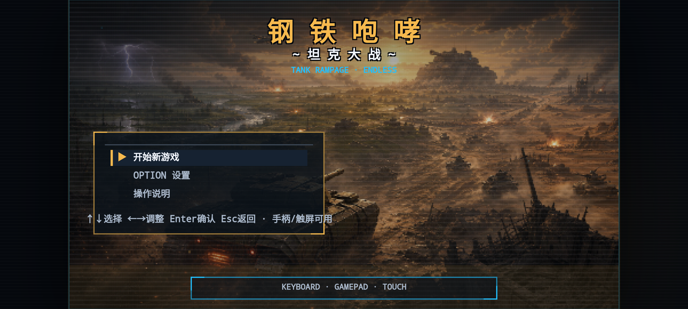

---

## 一、游戏简介

《钢铁咆哮 · 坦克大战》(Tank Rampage)是一款横版坦克突击动作游戏:你驾驶一辆孤军坦克,从干旱前线一路杀到末日废土,横跨**七场风格迥异的战役**。游戏采用 60Hz 固定步长物理 + HD-2D 像素渲染,配合作曲级原创 BGM(OpenGameArt CC0 素材)与电影式光照的关卡立绘。

**核心特色:**

- **七关连续战役 + 无限周目**:通关后进入下一周目,难度与报酬同步增长,强化与装备全部继承
- **四种武器自由切换**:机枪连发、主炮范围爆炸、蓄力追踪导弹、空袭支援
- **弹反系统**:受击 ±0.5 秒内开启护盾可完全无伤并反弹敌弹,连续弹反所有攻击
- **连击与 Overdrive**:5 秒内持续命中维持连击,60 连击进入 Overdrive,掉落率随段位提升
- **Roguelite 成长**:每关结算后用强化部件升级装甲/速度/攻击/防御,可随时全额退回重新分配
- **三种操作方式**:触屏虚拟按键 / 键盘 / 外接手柄(蓝牙或有线),自动识别、即插即用

---

## 二、快速上手(手机触屏)

1. 启动游戏自动进入**横屏全屏**标题画面
2. 点按菜单项或用虚拟方向键选择 **「开始新游戏」**,点按确认
3. 进入战斗后屏幕自动出现虚拟按键:

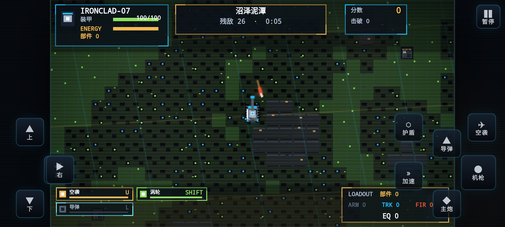

- **左侧**:▲▼◀▶ 方向键,控制坦克移动与朝向
- **右侧**:机枪(大按钮)/ 主炮 / 导弹 / 空袭
- **右中部**:加速(»)/ 护盾(⬡)
- **右上角**:暂停(❚❚)

> 消灭本关配额内的敌军后 BOSS 出场,击败 BOSS 即通关。血条归零则任务失败,可无限重试。

**手机常见操作:**

| 场景 | 操作 |
|---|---|
| 暂停 | 右上角 ❚❚ 按钮 |
| 退出游戏 | 安卓返回键按两次 |
| 跳过关卡开场 | 点按画面中央 |
| 结算继续 | 点按画面中央 |

---

## 三、操作说明(三模式)

### 3.1 触屏虚拟按键

手机上默认自动开启(检测到触屏即显示);也可在 **OPTION → 虚拟按钮** 中强制开/关。按键布局见上图。空袭与护盾为「点按触发」,其余为「按住持续」。

### 3.2 键盘

| 按键 | 功能 | 说明 |
|---|---|---|
| **W A S D** / 方向键 | 移动 | 地形影响速度:河流与沼泽大幅减速,荒地行驶会扬尘 |
| **J** | 机关枪 | 按住连发,射速快单发伤害低,适合消耗敌军装甲 |
| **K** | 主炮 | 爆裂弹,命中后小范围爆炸,对成群敌军效果最好 |
| **L** | 蓄力导弹 | 长按约 0.5 秒后松开发射,自动锁定最近敌军并大范围爆炸 |
| **U** | 空袭轰炸 | 支援飞机沿敌军密集处投弹,冷却 5 秒,弹药无限 |
| **Shift** | 涡轮加速 | 按住高速行驶,能量耗尽需冷却;高速冲撞敌军的前提 |
| **空格** | 能量护盾 | 受击瞬间(±0.5 秒窗口)发动可完全无伤并反弹敌弹,可连续发动 |
| **P / Esc** | 暂停 | 打开暂停菜单(继续/重开/回标题) |
| **Enter** | 确认 / 跳过 | 菜单确认、跳过开场、结算继续 |
| **R** | 重试 / 退点 | 失败后重试;通关画面按 R 可退回全部强化点重新分配 |

### 3.3 外接手柄(蓝牙 / 有线)

**即插即用,默认自动布局。** 手柄通过标准 Gamepad API 接入,连接后游戏立即弹出「手柄已连接」提示,无需任何配置。**十字键与左摇杆自动用于移动**——摇杆支持模拟量原生 360° 方向;十字键同时兼容「按钮上报」与「HAT 轴上报」两种形式(盖世小鸡 X2S 等 Android 模式手柄以 HAT 轴上报方向,v1.1 已适配);动作键采用通用默认布局(与盖世小鸡 X2S 等主流安卓手柄一致):

| 默认按键 | 动作 | 备注 |
|---|---|---|
| **A / ✕ (0)** | 机关枪(连发)· 菜单确认 | |
| **B / ○ (1)** | 空袭轰炸 · 菜单返回 | |
| **X / □ (2)** | 主炮 | |
| **Y / △ (3)** | 蓄力导弹 | |
| **LB (4)** | 能量护盾(弹反) | **LT (6) 同护盾**(未改键时自动生效) |
| **RB (5)** | 涡轮加速 | **RT (7) 同机枪**(未改键时自动生效) |
| **Start/Options (9)** | 暂停 | |
| **十字键 / 左摇杆** | 移动(摇杆 360°) | 十字键支持按钮/HAT 轴两种上报 |

菜单、操作说明、战地整备界面同样支持手柄导航(方向选择 + A 确认 + B 返回)。

> 按键名按**物理位置**对应(南=A、东=B、西=X、北=Y),与手柄丝印无关。X2S 等采用任天堂丝印布局的手柄请以按键位置为准。

**重新设置按键布局(自定义映射):**

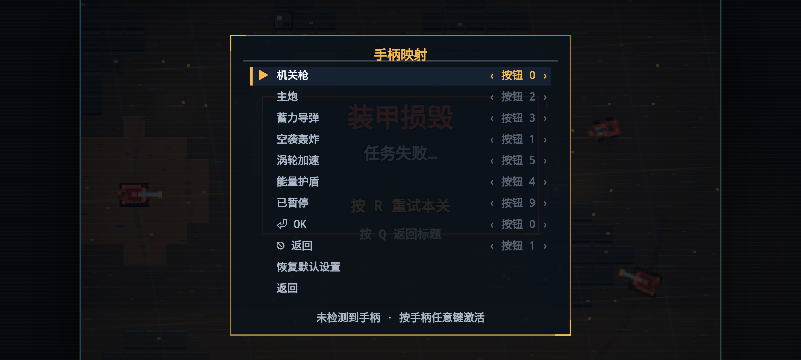

1. 标题菜单 → **OPTION 设置** → **手柄映射**
2. 选中要改的动作(机枪 / 主炮 / 导弹 / 空袭 / 加速 / 护盾 / 暂停 / 确认 / 返回,共 9 项)
3. 按下手柄上想要绑定的新按钮,屏幕显示「按钮 N」即绑定成功
4. 选择 **恢复默认** 可一键还原全部默认布局

映射保存在本地存档中,重启后保持。未检测到手柄时界面会提示「未检测到手柄 · 按手柄任意键激活」——部分手柄需要按任意键唤醒后才会被系统识别。

### 3.4 战前键位速览(开局演示页)

每次**开始新游戏**时会先出现动态键位演示页:自动识别当前输入方式并展示对应布局,逐项高亮讲解每个按键的功能(金色脉冲指示),按 **A / Enter / 点按任意处** 即可跳过进入战斗;◀ ▶(或点按顶部标签)可切换查看手柄 / 触屏 / 键盘三种布局。

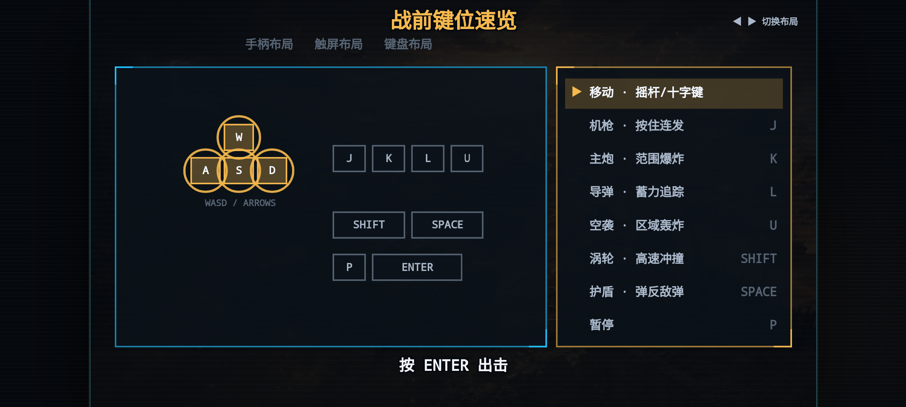

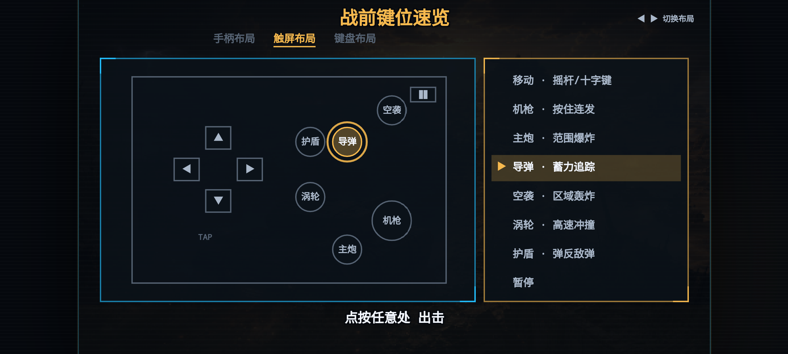

### 3.5 智能按键提示

游戏内所有按键提示**随输入方式自动切换**:键盘输入时显示 J/K/L/U,连上并使用手柄后自动变为 A/X/Y/B 等手柄键名,触屏操作则隐藏键名(虚拟按钮自带中文标签)。标题画面底部的输入模式条会实时高亮当前生效模式(手柄模式效果见下图)。

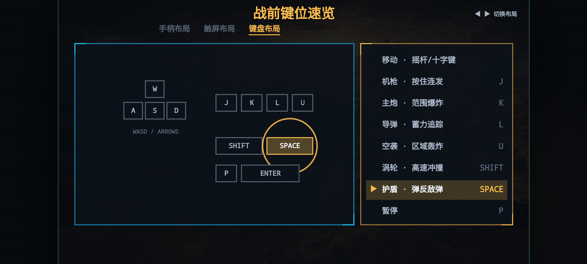

### 3.6 我方机体(三选一)

「开始新游戏」后先选择机体,三型性能随机体改变(均衡型 = 基准):

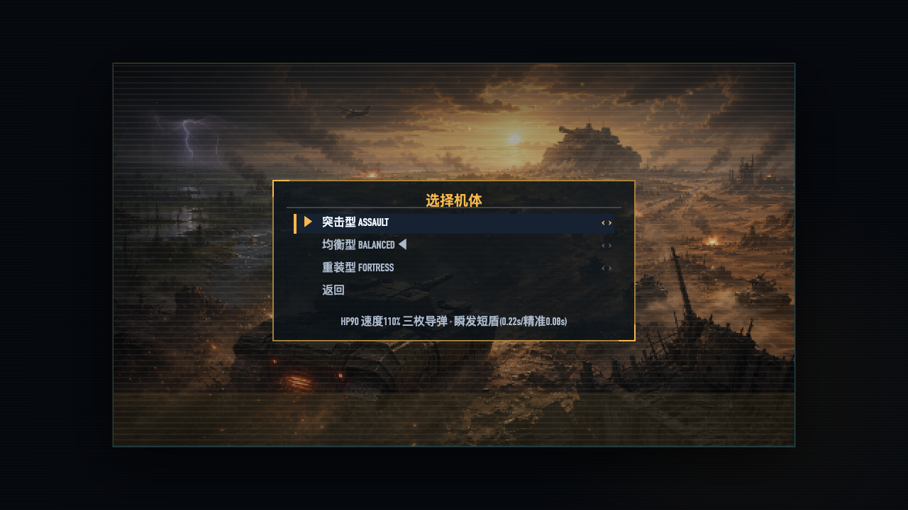

三型拥有**专属外观**与 HUD 呼号,选择菜单中有实车动态预览:

| 机体 | 外观 | 呼号 | 特性 |
|---|---|---|---|
| **突击型 ASSAULT** | 疾行橙涂装 · 轻量车身 · 单长炮 · 金色护盾环 | STRIDER-03 | HP90 · 速度110% · 冲刺120% · **三枚分锁导弹**(多敌各锁其一/单敌 100/65/50 衰减)· 瞬发短盾(0.22s,精准窗口 0.08s,高风险高回报) |
| **均衡型 BALANCED** | 钢青标准涂装 · 均衡车身 · 单管炮 · 青色护盾环 | IRONCLAD-07 | 基准性能 · 标准盾(0.42s/精准 0.12s)· 全面适应 |
| **重装型 FORTRESS** | 深铁灰重甲 · **大体型双联主炮** · 金色装甲条 · 赤红护盾环 | BASTION-09 | HP125 · 主炮 118% · 爆破范围 120% · 速度 88% · 要塞盾(最长持续 4s,持续期反弹伤害 75%,开局 0.18s 内反弹 200%) |

### 3.7 僚机系统

选完机体后选择僚机(默认配对已预选并标 ★,可自由更换):

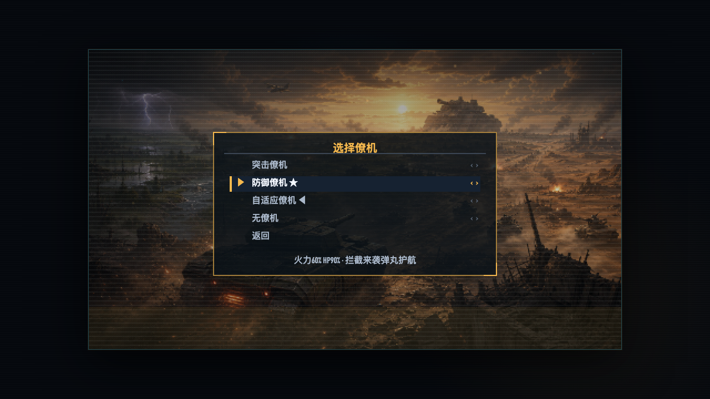

| 僚机 | 特性 | 默认配对 |
|---|---|---|
| **突击僚机** | 火力 78% · HP70% · 主动逼近索敌强攻 | 重装型 |
| **防御僚机** | 火力 60% · HP90% · 贴身护航并**拦截来袭弹丸** | 突击型 |
| **自适应僚机** | 火力 70% · HP80% · 检测到威胁自动切换攻/守 | 均衡型 |
| **无僚机** | 单人作战 | — |

僚机与玩家机体**互为实体**:互相不能穿模,相撞会按质量互相推挤(僚机轻、让位更多,玩家被轻微推开并损失少量冲速),与敌军同样保持实体边界。僚机会被敌弹击中,受损后撤离维修 8 秒,然后以 50% 血量返场;每关自动随你部署。

### 3.8 战前键位速览(实况演示)

键位速览页新增**实况游戏画面演示窗**:每个按键动作对应一段引擎实况画面(移动/机枪/主炮/导弹/空袭/涡轮/护盾/暂停),与布局图解、动作条联动循环,点按动作条可直接跳转。

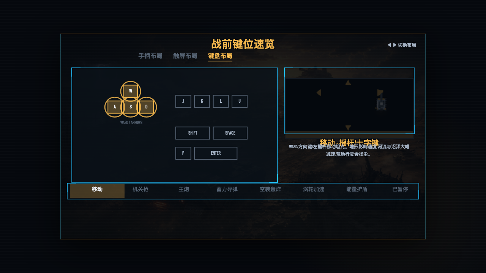

### 3.9 Debug 模式(秘籍)

在**标题画面**按经典秘籍(仅当次会话有效,输错立即重置,间隔超 2 秒重置):

**↑ ↑ ↓ ↓ ← → ← → J K ENTER**(手柄:十字键同序 + 机枪 + 主炮 + 暂停)

成功后左上角短暂显示 `DEBUG MODE ENABLED`,主菜单多出 **DEBUG MODE** 项:可开关 God Mode、调整 HP 上限/攻击倍率/防御/速度。Debug 会话**不更新最高分、不写正式存档**。

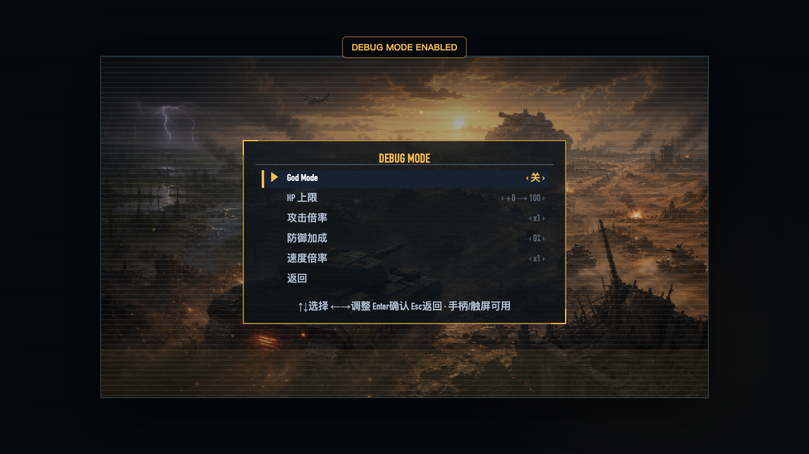

---

## 四、核心系统

### 4.1 武器系统

| 武器 | 特性 | 使用场景 |
|---|---|---|
| 机关枪 | 射速快、单发低伤、无限弹药 | 消耗装甲、触发连击、补刀 |
| 主炮 | 小范围爆炸、直射 | 成群敌军、狭窄地形 |
| 蓄力导弹 | 追踪锁定 + 大范围爆炸 | 精英敌、密集阵 |
| 空袭 | 冷却 5 秒、区域轰炸、弹药无限 | 敌军波次密集处、BOSS 战 |

### 4.2 涡轮加速与冲撞

涡轮(Shift/RB)提供高速行驶,能量耗尽后需冷却恢复。**高速撞击敌车造成伤害,60% 概率会心一击(伤害 ×2)**;冲撞或反弹击破的敌军,优质掉落率大幅提高。

### 4.3 能量护盾与完美弹反

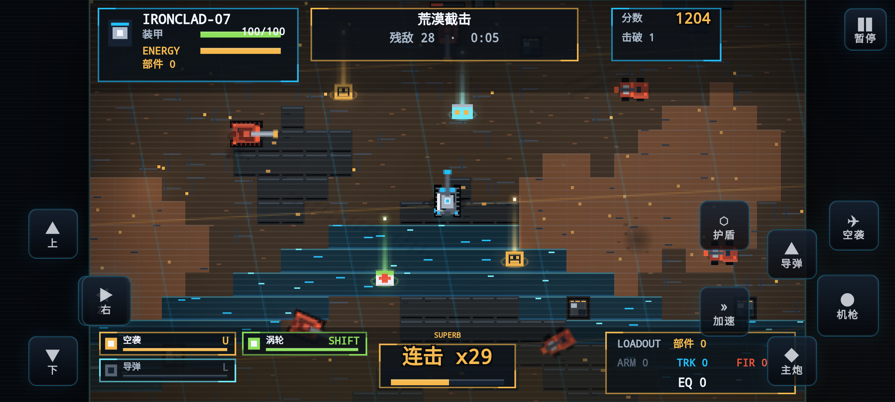

在受击的 **±0.5 秒窗口**内开启护盾(空格/LB)可完全无伤并**反弹敌弹**;掌握节奏可以连续发动、反弹所有攻击。弹反击破的敌军同样享受优质掉落加成,是高风险高回报的核心技巧。

### 4.4 连击与 Overdrive

| 机制 | 数值 |
|---|---|
| 连击窗口 | 每次命中刷新,5 秒不中断 |
| 命中权重 | 机枪 +1 / 主炮·导弹 +2 / 击破 +3 / 冲撞 +4 / BOSS +5 / 反弹 +3 |
| 段位 | 每 10 连升 1 段,最高 6 段(60 连) |
| 分数倍率 | 10 连 ×1.10 / 20 连 ×1.20 / 30 连 ×1.35 / 40 连 ×1.50 |
| **Overdrive** | 连击 ≥60 触发,掉落率随段位提升 |

### 4.5 掉落与报酬

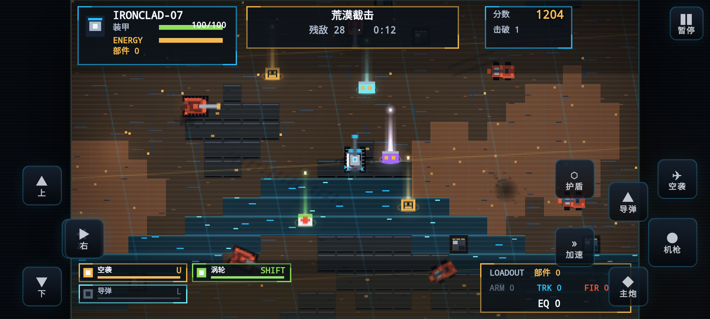

击破敌军有几率掉落**修理包 / 强化部件 / 强化装备**;BOSS 必掉大量报酬。难度越高、连击段位越高,回报越大。

### 4.6 战地整备(局内成长)

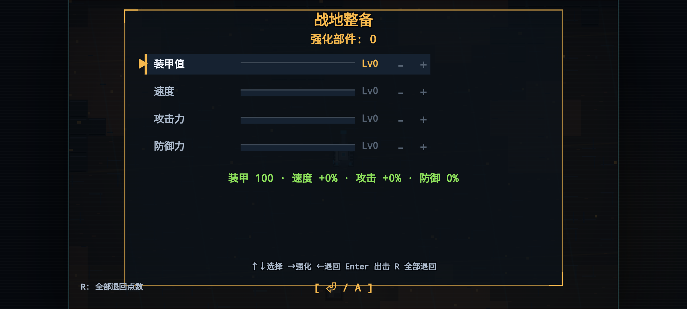

每关结束进入战地整备,用本关获得的强化部件点数升级四维:**装甲 / 速度 / 攻击 / 防御**。每次通关(或结算画面按 R)可**全额退回重新分配**,周目间永久继承。

### 4.7 难度与周目

OPTION 中 5 档难度(影响敌方 AI、血量、命中率和掉落/报酬倍率 ×1.0~×2.0)。通关第 7 关后按 Enter 进入下一周目:难度递增、报酬按周目继续加成,无限循环。

---

## 五、HUD 图解

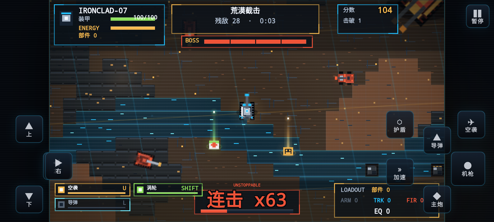

- **左上**:玩家血条(HP)
- **顶栏**:本关击破数 / 配额、连击数与段位、得分
- **武器图标行**:四种武器 + 涡轮能量条 + 空袭冷却
- **BOSS 战**:顶部出现 BOSS 血条(受击后显示白字残余血量残影)
- **Overdrive 激活时**:画面有专属特效提示

---

## 六、七大关卡图鉴

| 关卡 | 代号 | 叙事 / 主色 |
|---|---|---|
| 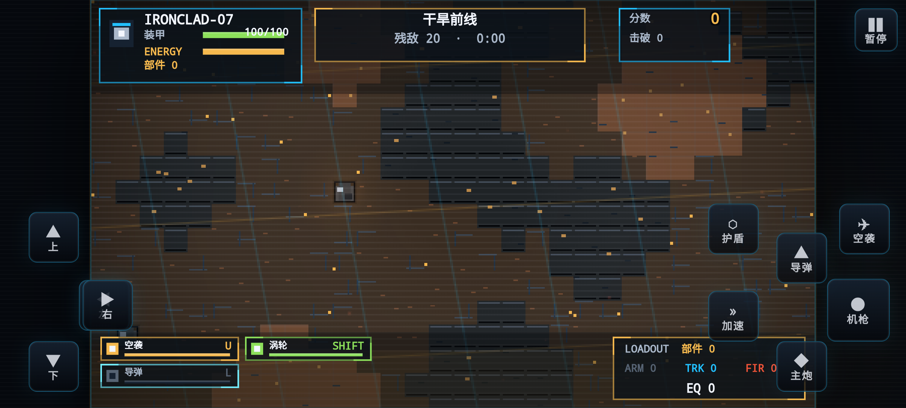 | **STAGE 1 前哨基地** | 干旱前线、首次出征 / 土黄 |
| 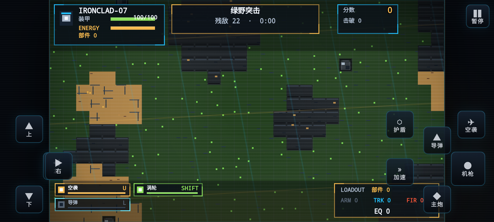 | **STAGE 2 绿野突击** | 绿野机动、速度与活力 / 绿色 |
| 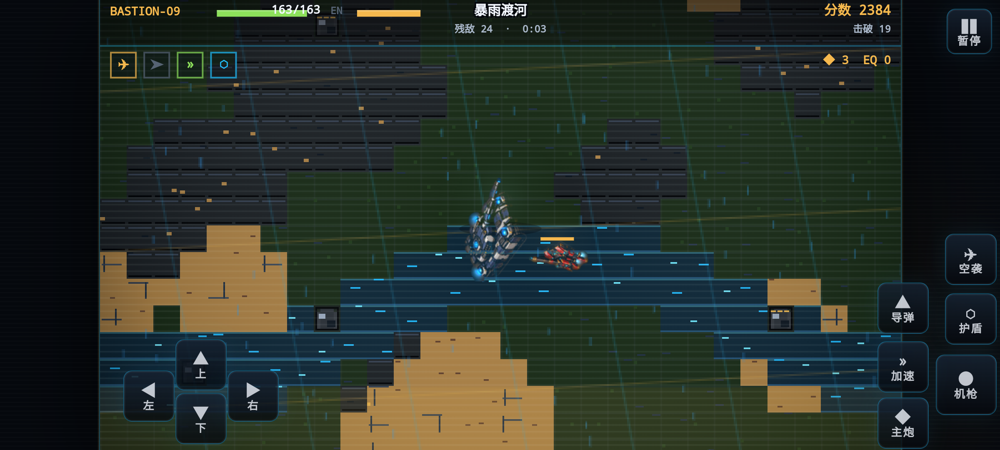 | **STAGE 3 暴雨渡河** | 暴雨渡河、自然与火力 / 蓝灰 |
| 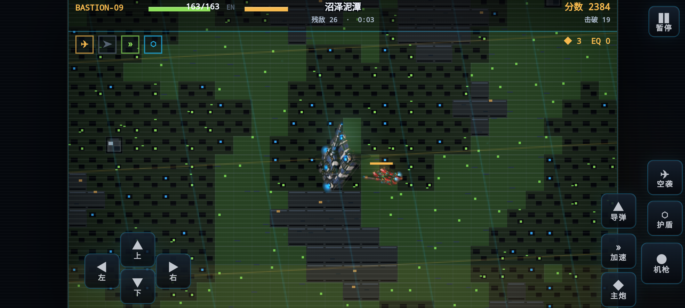 | **STAGE 4 沼泽伏击** | 沼泽迟滞、伏击压迫 / 墨绿 |
| 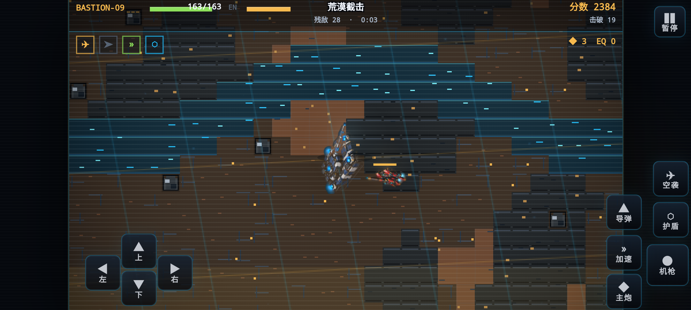 | **STAGE 5 荒漠截击** | 荒漠截击、高速包围 / 金橙 |
| 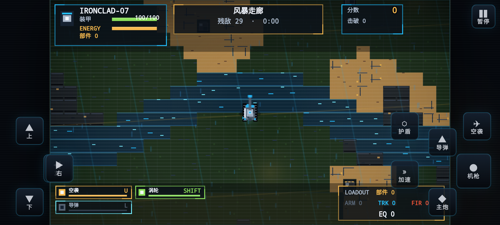 | **STAGE 6 风暴走廊** | 风暴走廊、精锐火力 / 深蓝黑 |
| 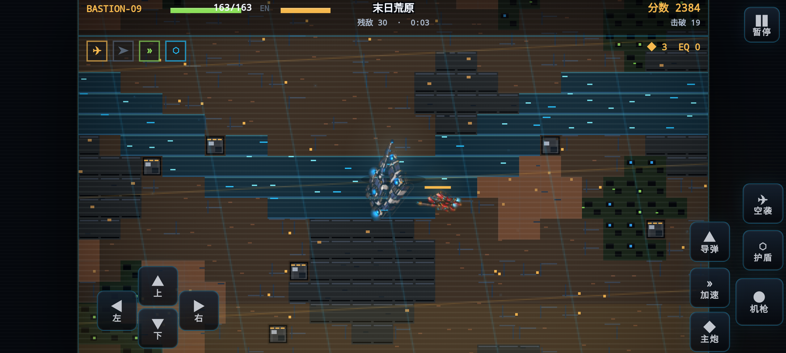 | **STAGE 7 末日决战** | 末日决战、最终 BOSS / 黑红 |

每关以电影级立绘开场(Ken Burns 缓推 + 主题粒子),战场地形与天气各不相同:荒地扬尘、雨天闪电(偶尔劈中敌军)、河流沼泽减速——善用地形走位与掩护。

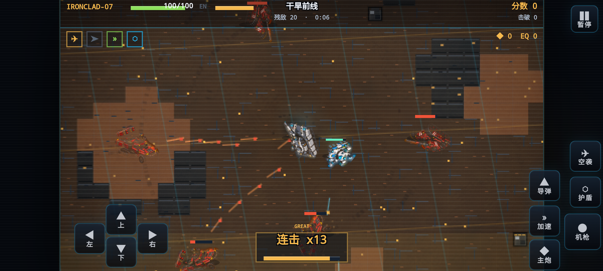

敌军包含轻装甲单位、主战坦克、精锐型号与每关镇守的 **BOSS 级巨型坦克**:

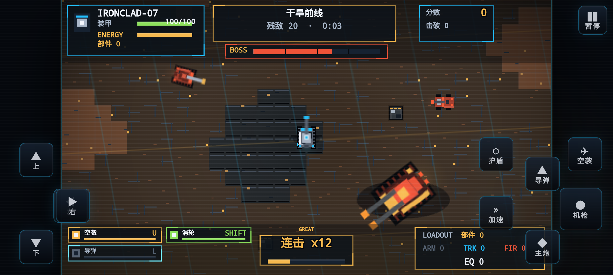

---

## 七、结算与失败

- **任务完成**:显示击破数、用时、得分与奖励点数,随后进入战地整备
- **战斗失败**:血条归零后可按 R / 点按画面无限重试,周目进度不受影响

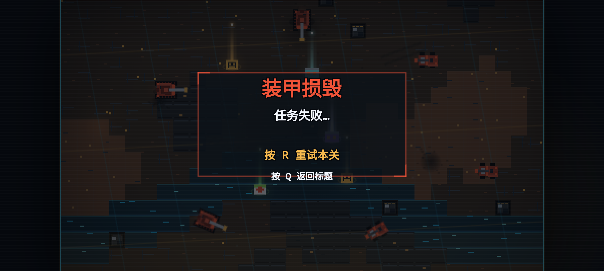

---

## 八、设置菜单(OPTION)

| 项目 | 说明 |
|---|---|
| 语言 | 简体中文 / English / 日本語 |
| 难度 | 5 档,影响敌方强度与报酬倍率 |
| 音乐 / 音效 | 0~4 档音量 |
| 虚拟按钮 | 自动(推荐)/ 开 / 关 |
| 手柄映射 | 自定义手柄按键布局,详见 3.3 节 |
| 恢复默认 | 全部设置还原 |

游戏内还有 **13 页交互式操作说明**(标题菜单 → 操作说明,←→ 翻页),全部截图见 `img/help/` 目录。

---

## 九、小贴士

1. **弹反比硬扛划算**:反弹击杀掉落更好,还进连击
2. **冲撞前先开涡轮**:高速撞击 + 会心 = 秒杀轻甲
3. **空袭留给波次**:敌军扎堆时收益最大
4. **连击断了别慌**:10 秒内重新堆到 40 连仍有 ×1.5 倍率
5. **沼泽是陷阱也是武器**:敌军追击进沼泽同样减速,拉開距离风筝
6. **雨天躲开水域**:闪电偶尔劈中水域附近单位
7. **周目重配**:每关前都可退回全部点数,按当前关卡特点重配(如 BOSS 关堆攻击)
8. **进度自动保存**:关卡、强化、设置全部本地保存,随时关游戏不丢进度

---

*本文档截图全部来自 Redmi 真机(Android 13)实机运行画面。*
*游戏音乐素材来自 OpenGameArt.org(CC0 公有领域),详见游戏内制作名单。*
