# 钢铁咆哮 · 坦克大战 — 页面与按钮导览

> 本文所有截图都来自真实运行的游戏，所有按钮行为都经过逐个实测。配图在 `img/` 目录，按文中编号对应。
> 游戏简介与系统详解见同目录上级的《游戏介绍与操作说明》，本文专注「哪个页面、哪个按钮、点了会怎样」。

---

## 一、这是什么 & 怎么开始

《钢铁咆哮·坦克大战》是一款横版坦克突击游戏：驾驶坦克连闯七个战场，击破敌军、捡强化部件、打 BOSS，通关后进入更难的下周目，无限循环。

- **手机 / 平板**：安装游戏包即可（最新版本见 [GitHub Release](https://github.com/rance1230/steel-roar-tank-battle/releases/tag/v1.3.3)），启动后自动横屏全屏。
- **电脑**：双击游戏文件，用 Chrome / Edge / Firefox / Safari 任一浏览器打开即玩。
- 支持三种操作方式：**触屏、键盘、外接手柄**，自动识别，也可在设置里切换。

---

## 二、标题画面

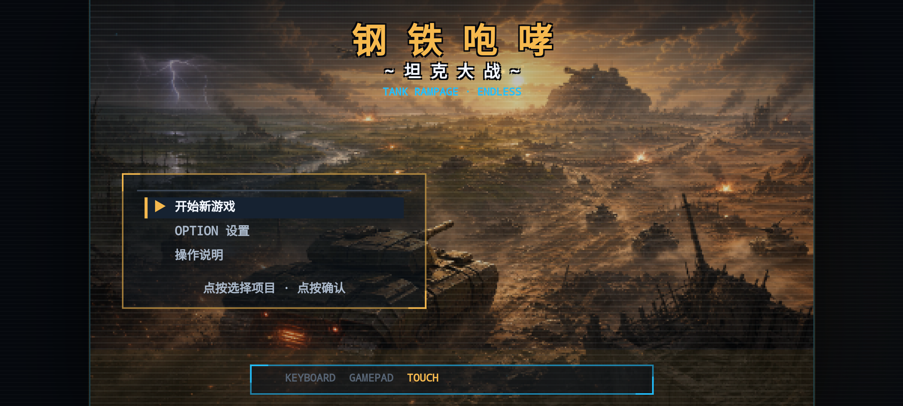

启动游戏首先看到标题画面。菜单用「点按选择项目 · 点按确认」：

| 菜单项 | 点了会怎样 |
|---|---|
| 「开始新游戏」 | 进入机体选择（见第五节） |
| 「继续存档」 | 回到上次进度。**没有进度时这一项不出现**——只要通关过一关，标题画面就会多出这一行（见第九节） |
| 「OPTION 设置」 | 打开设置页（见第三节） |
| 「操作说明」 | 打开游戏内置的图文帮助，共 13 页（见第四节） |

画面底部有一条 **KEYBOARD / GAMEPAD / TOUCH** 指示条，当前生效的操作方式会高亮——手机上一般是 TOUCH。

---

## 三、OPTION 设置

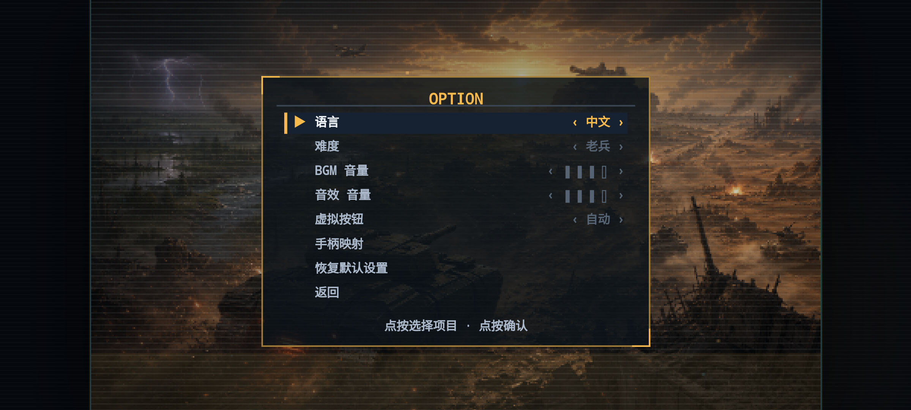

| 设置项 | 怎么用 | 实测行为 |
|---|---|---|
| 「语言」 | 点按行 | 在 中文 → 日本語 → English 之间循环切换，立即生效（下图是英文界面） |
| 「难度」 | 点按行 | 循环切换：新兵 → 熟练 → 老兵（默认） → 精英 → 王牌 → 回到新兵；选中难度时底部会提示难度影响敌军 AI / 反应 / 耐久 / 精准 / 掉落与回报 |
| 「BGM 音量」/「音效 音量」 | 点按行 | 4 格循环，调音效时会播一声试听 |
| 「虚拟按钮」 | 点按行 | 「自动」→「开」→「关」循环。自动 = 触屏设备自动显示；开 = 强制显示；关 = 隐藏 |
| 「手柄映射」 | 点按行 | 进入手柄按键自定义页（见下） |
| 「恢复默认设置」 | 点按行 | 语言、难度、音量、虚拟按钮全部回到默认 |
| 「返回」 | 点按行 | 回标题画面 |

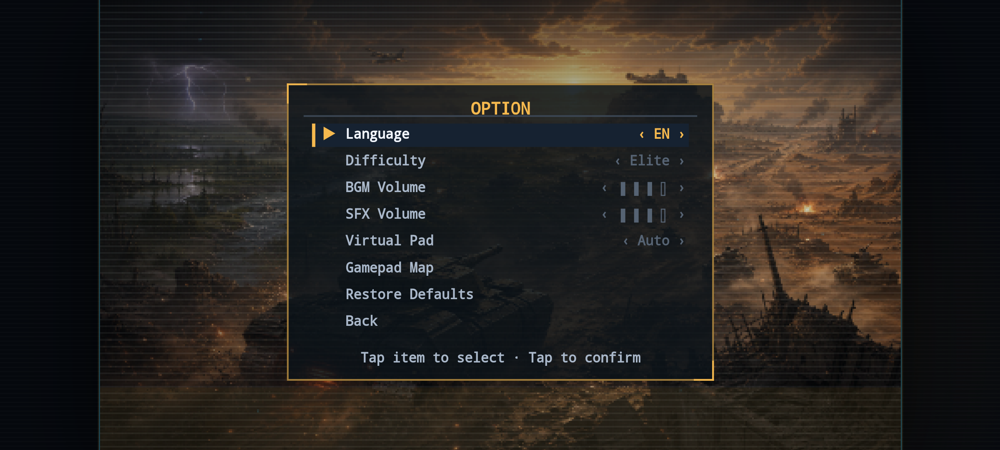

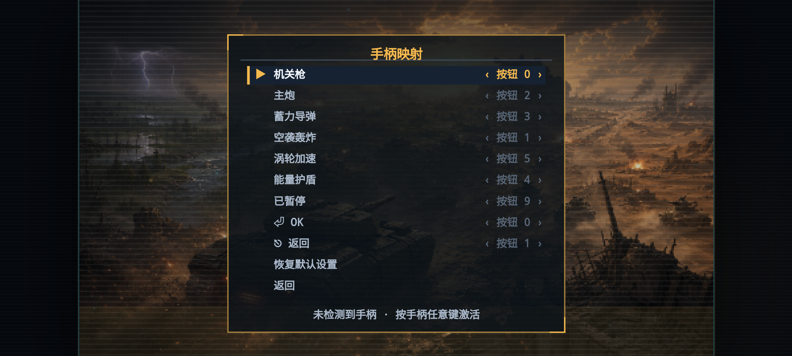

「手柄映射」页列出每个动作当前对应的手柄按键（机枪、主炮、蓄力导弹、空袭轰炸、涡轮加速、能量护盾、暂停、OK、返回），点按某一行再按手柄上的键即可改键，「恢复默认设置」一键还原。没插手柄时底部会提示「未检测到手柄」。

> 小提示：「语言」「难度」「BGM 音量」「音效 音量」都是点一下换下一个、到头自动回到开头，来回都能调。

---

## 四、操作说明（游戏内帮助）

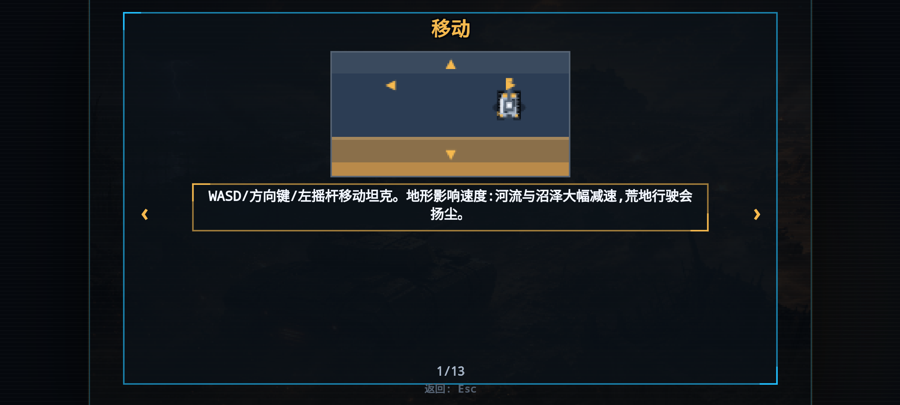

共 13 页图文，讲移动、四种武器、涡轮、护盾、连击、掉落、机体与僚机等。翻页与退出：

- **点左边缘** → 上一页；**点右边缘** → 下一页
- **点顶部区域** → 返回标题画面

v1.3 新增的两页如下：「我方机体」讲三种机体的差别，「僚机系统」讲僚机的种类与默认配对。

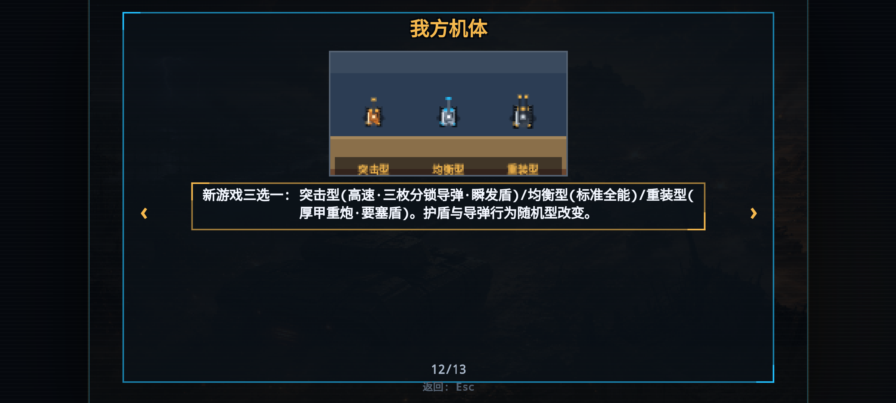

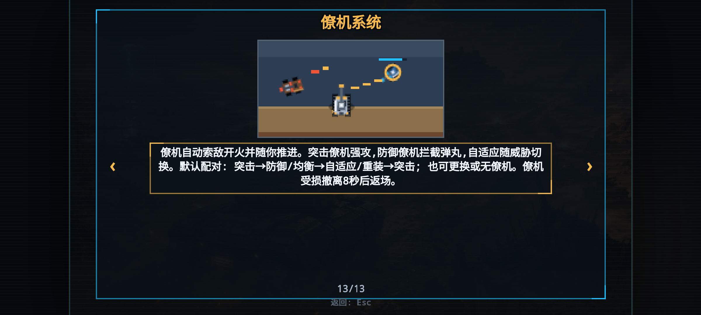

---

## 五、开始一局：机体 → 僚机 → 键位速览 → 出击

点「开始新游戏」后依次经过三个页面：

### 1. 选择机体

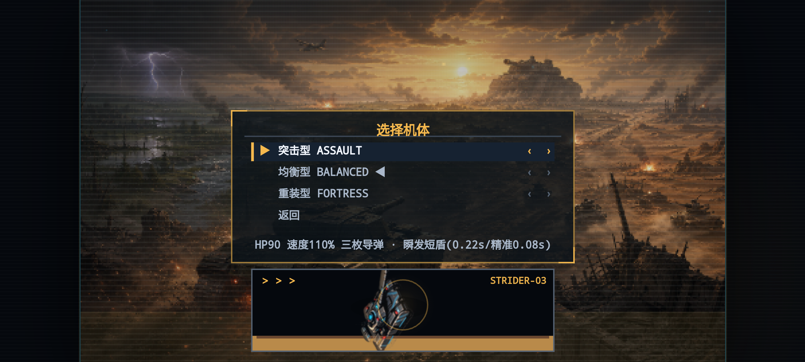

三选一，选中哪行底部就显示它的参数，**菜单下方同时显示该机体的实车动态预览**（高清立绘，点不同行即时切换，右上角是呼号）：

| 机体 | 特点（界面原话） |
|---|---|
| 突击型 ASSAULT | HP90 速度110% 三枚导弹 · 瞬发短盾 |
| 均衡型 BALANCED | 基准性能 · 标准盾 · 全能适应 |
| 重装型 FORTRESS | HP125 重炮118% 爆破120% · 要塞盾 |

点按机体行即选中并进入下一页；点「返回」可回标题。

### 2. 选择僚机

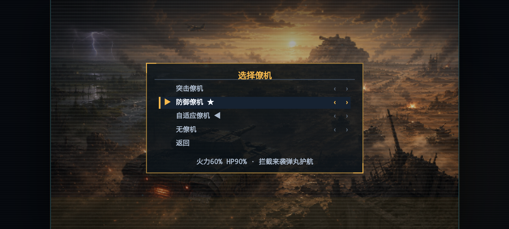

四种僚机（突击 / 防御 / 自适应 / 无）。带 ★ 的是当前机体的推荐搭配（例如突击型 → 防御僚机），选中行底部会显示火力 / 耐久与定位说明。点按即确认。

### 3. 战前键位速览

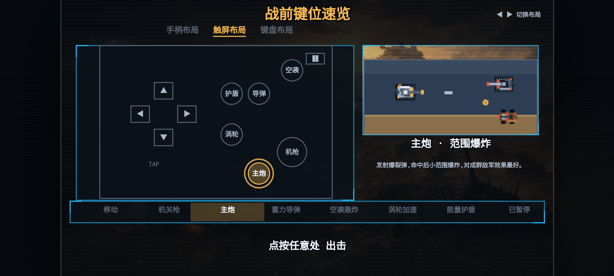

出击前的最后一页，动态演示当前操作方式的按键布局：

- 顶部「手柄布局 / 触屏布局 / 键盘布局」三个页签，点按切换（上图为触屏布局，下图为键盘布局）
- 右侧小窗实时演示按键对应的战场动作，底部条同步高亮当前讲的按键
- **点按页面空白处即出击**

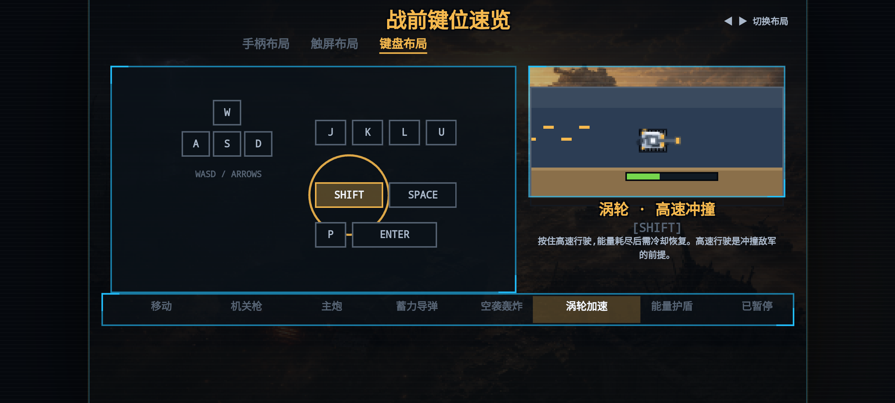

### 4. 关卡开场

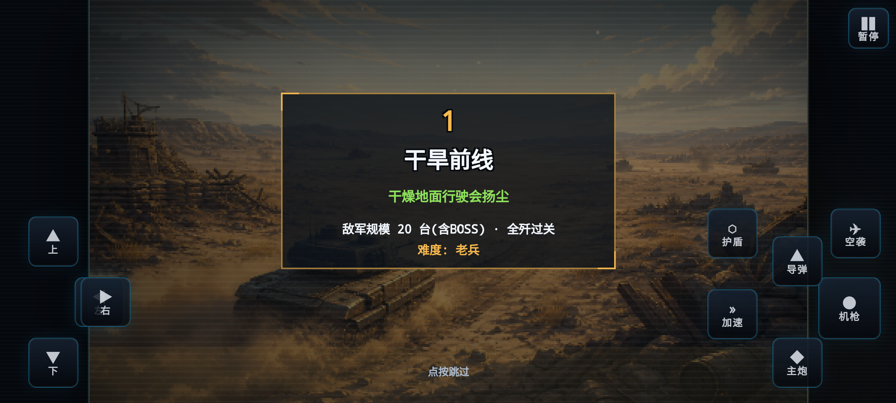

每关开始有一张战场立绘 + 关卡卡（第 1 关「干旱前线」：敌军规模 20 台(含BOSS) · 全歼过关、当前难度）。**点按任意处跳过**，直接进入战斗。

---

## 六、战斗界面：HUD 与触屏按钮

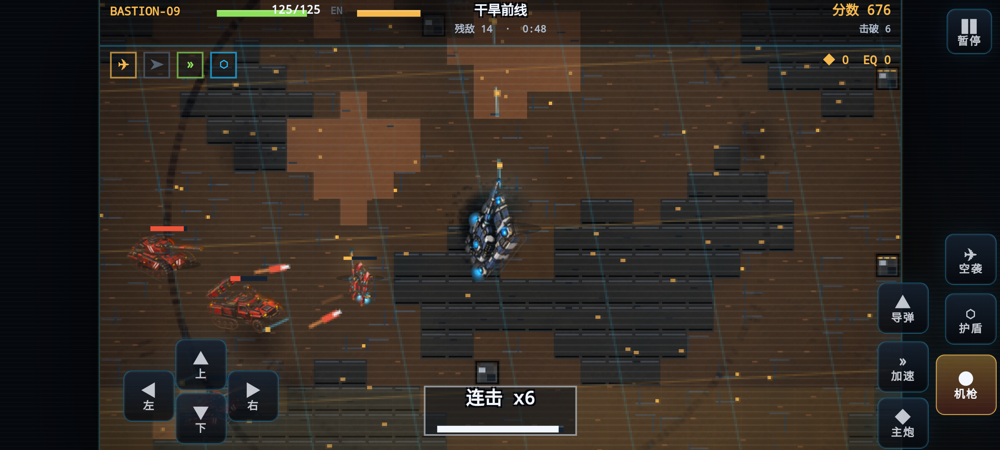

我方机体、僚机、敌军与 BOSS 均为高清立绘，随移动平滑转向；像素风战场之上，UI 走轻量半透明路线，尽量不遮画面。

### 顶部信息条（一条看完所有状态）

| 位置 | 内容 | 含义 |
|---|---|---|
| 左 | 机体呼号（如 BASTION-09）+ 血条与数值 | 血量归零即任务失败 |
| 左 | 「EN」+ 黄条 | 涡轮加速消耗的能量，会自动回复 |
| 中 | 关卡名、下方「残敌 14 · 0:48」 | 还需击破的敌军数与本关用时；二周目会显示「#2 ·」标记 |
| 右 | 「分数」「击破」 | 当前得分与总击破数 |

### 武器芯片与部件

信息条下方一排四个小芯片（触屏时在顶栏下、键鼠在左下角），亮框=可用，暗框=冷却/耗尽中，导弹芯片蓄力时会实时填充：**✈空袭 · ➤导弹 · »涡轮 · ⬡护盾**。右侧的「◆ 数字」是捡到的强化部件数（整备时用），「EQ」是已装备的强化数。战斗中连续命中会弹出「连击 x6」提示并随时间条衰减：

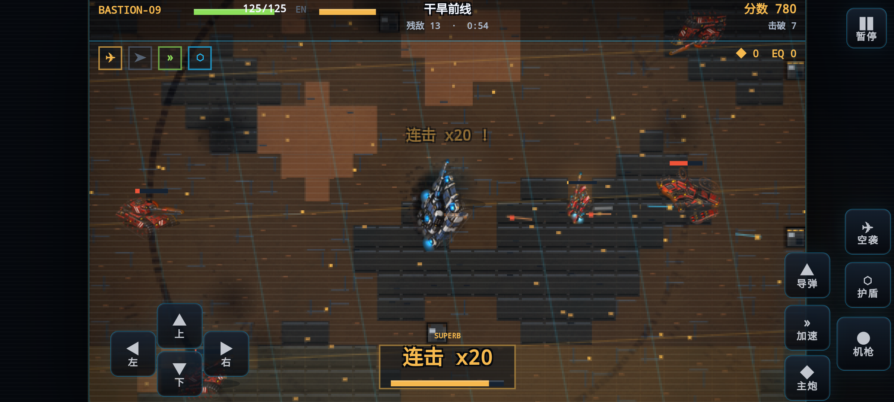

### 触屏按钮（左下 + 右缘两列）

手机上战斗时自动显示虚拟按钮，左右两组互不重叠、中间留出完整画面（隐藏/强制显示见第三节「虚拟按钮」）：

| 按钮 | 怎么操作 | 点了会怎样 |
|---|---|---|
| ▲▼◀▶（左下，菱形排布） | 按住 | 移动坦克，按钮按住时高亮 |
| 「空袭」(右缘最上) | 点按 | 呼叫支援飞机沿敌军密集处投弹，之后进入冷却（芯片会缓慢回复） |
| 「导弹」 | **按住约半秒后松手** | 先蓄力，松开发射自动追踪的导弹（下图双导弹齐射） |
| 「加速」 | **按住** | 涡轮高速行驶，同时消耗 EN 能量条（见下图能量条变短、按钮高亮） |
| 「护盾」 | 点按 | 展开短时护盾（要塞盾为一圈红环），挡下伤害；受击瞬间开启还能把敌弹反回去 |
| 「机枪」「主炮」(右下) | 机枪**按住** / 主炮点按 | 机枪连射（按住期间按钮高亮）；主炮发射爆裂弹，命中点小范围爆炸 |
| 「❚❚暂停」(右上角) | 点按 | 打开暂停菜单（见第七节） |

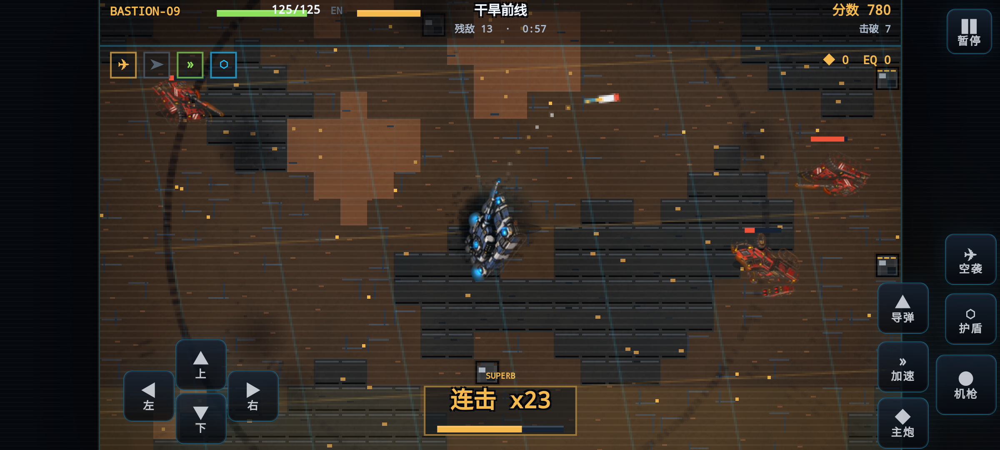

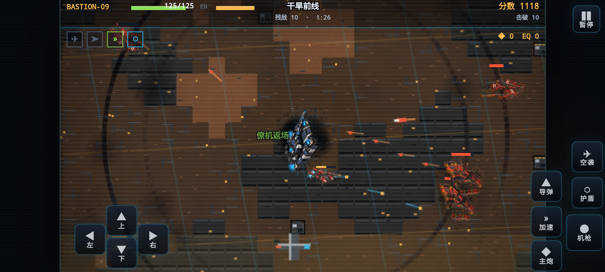

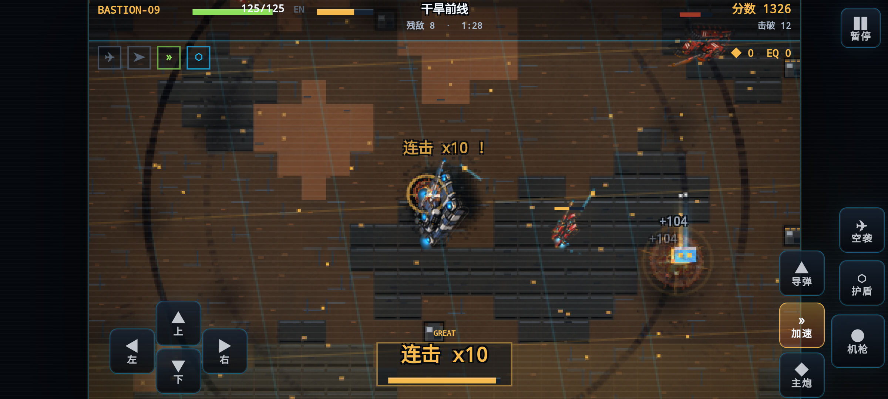

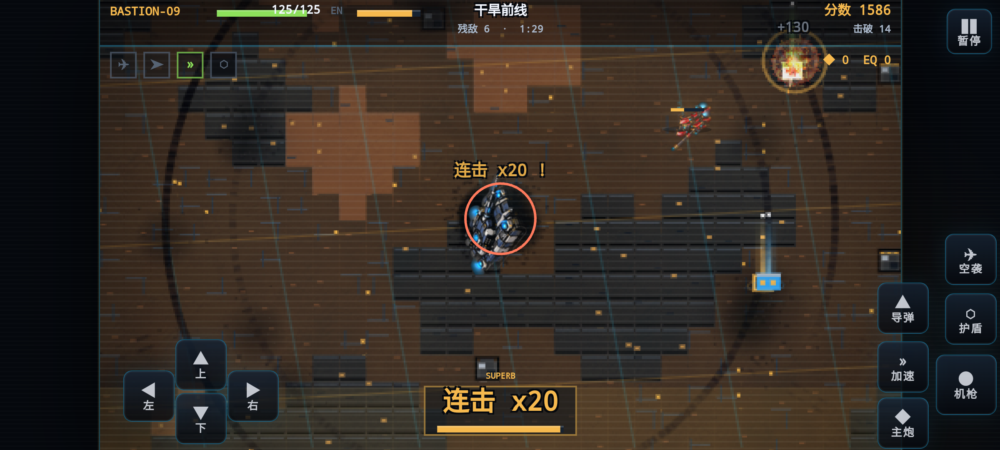

### 掉落与报酬

击破敌军有几率掉落补给（下图右侧带光柱的补给箱），开过去即可拾取：修理包回复装甲，部件累计到「◆」计数，装备直接强化性能。

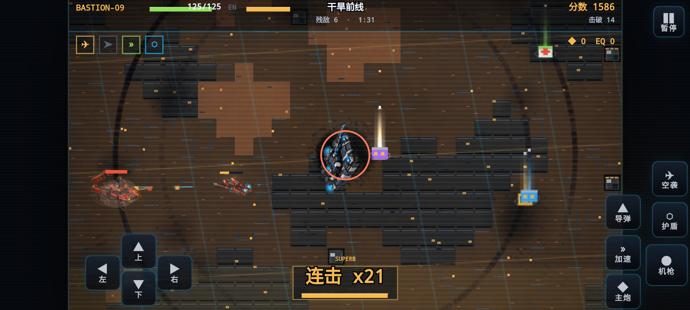

---

## 七、BOSS、暂停与失败

### BOSS 战

清完本关配准确数后 BOSS **当场现身**（顶部出现红色分段 **BOSS 血条** 与「!! BOSS 来袭 !!」警告），打空血条即过关。BOSS 会主动追击，冲刺前有「!!」预警和蓄力抖动，看到提示及时拉开距离：

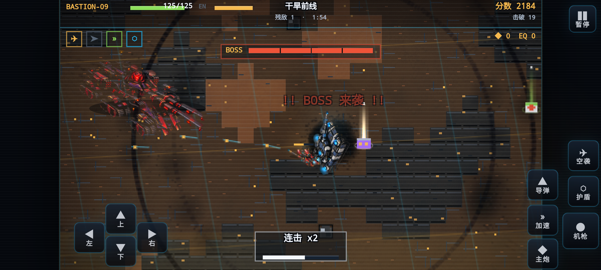

### 暂停菜单

点右上角「❚❚暂停」：

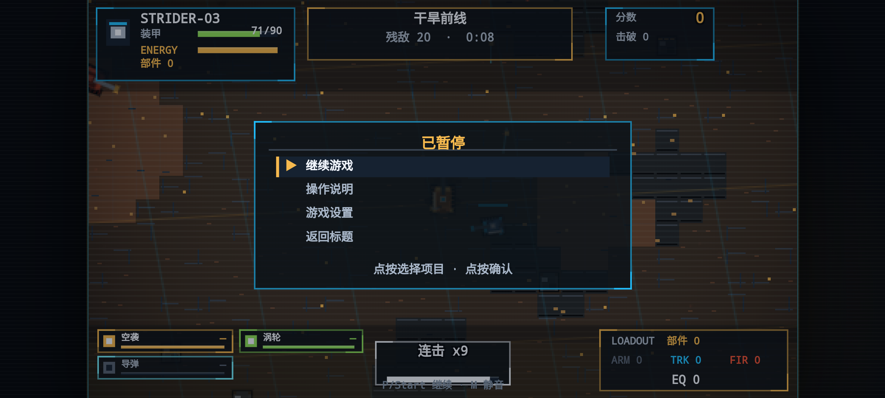

| 菜单项 | 点了会怎样 |
|---|---|
| 「继续游戏」 | 回到战斗，画面保持暂停时的样子 |
| 「操作说明」 | 战斗中也能翻帮助 |
| 「游戏设置」 | 战斗中调语言/难度/音量等 |
| 「返回标题」 | 结束本局回标题画面 |

### 任务失败

装甲归零弹出「装甲损毁 / 任务失败」：

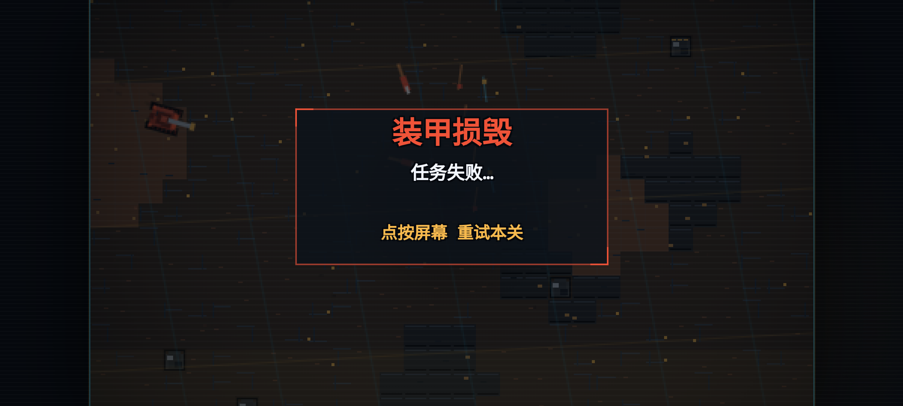

- **点按屏幕** → 重试本关（从本关开场重新开始）
- 键盘按 R 同样重试

---

## 八、过关结算与战地整备

全歼敌军（含 BOSS）后弹出结算：

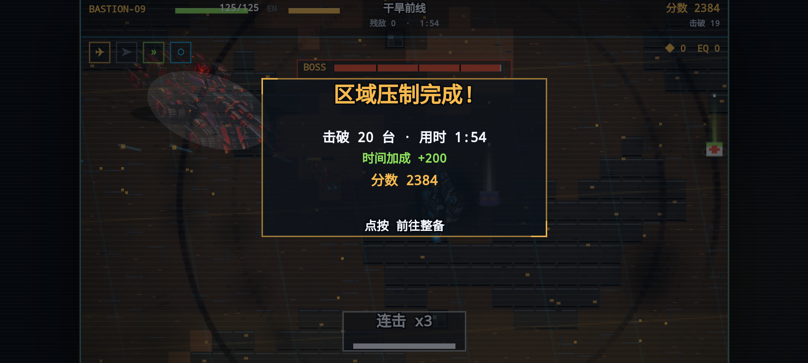

显示击破数、用时、时间加成与分数。**点按屏幕「前往整备」**进入（不点也会在约 4 秒后自动进入）：

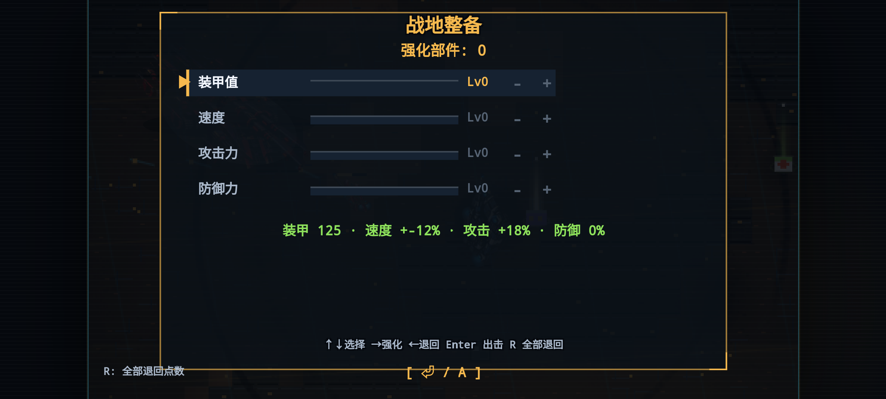

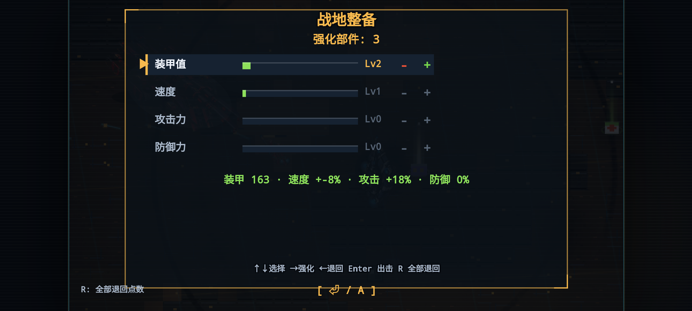

用捡到的「强化部件」给四项属性加点：装甲值 / 速度 / 攻击力 / 防御力。

| 操作 | 效果 |
|---|---|
| 点属性行的「+」 | 消耗 1 部件，该属性升一级（上图为装甲 Lv2、速度 Lv1，剩 3 部件） |
| 点属性行的「−」 | 退回该属性 1 级，部件返还 |
| 左下角「退回点数」按钮 | 全部加点一键清空，部件全额返还，可重新分配 |
| 底部中央按钮 | 确认分配，出击进入下一关 |

---

## 九、存档与继续游戏

过关（进入整备）时游戏自动保存。此后回到标题画面，会多出一行「继续存档」：

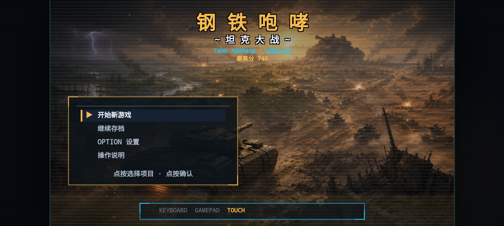

- 点「继续存档」直接回到上次的整备界面，已分配的加点都在
- 「开始新游戏」会开新档，不影响继续存档
- 想彻底重开：新档打到下一关过关即可覆盖

---

## 十、小彩蛋：DEBUG MODE

在**标题画面**依次输入 ↑ ↑ ↓ ↓ ← → ← → 再按 机枪键(J)、主炮键(K)、确认键(Enter)，会开启隐藏的 DEBUG MODE，标题菜单多出一项：

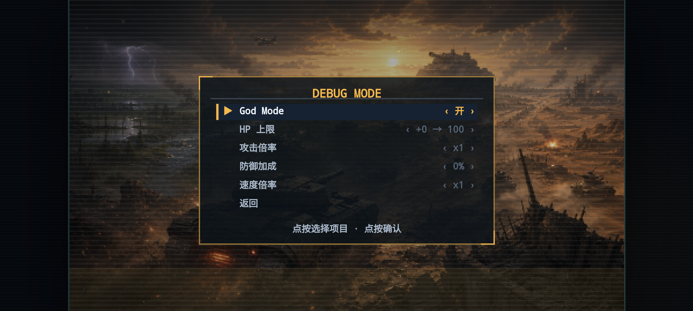

可以开关 God Mode（无敌）、调整 HP 上限 / 攻击倍率 / 防御加成 / 速度倍率。调试内容不写入存档、不影响最高分；重启游戏后自动关闭。

---

## 十一、常见问题

**Q：安卓返回键按了没反应？**
按一下返回键游戏不会退出，会出现「再按一次返回键退出」的提示；连按两下才会真正关闭游戏。按返回键后如果出现系统的全屏提示，点「Got it」即可。

**Q：电脑上怎么操作？**
WASD 移动、J 机枪、K 主炮、L 蓄力导弹、U 空袭、Shift 涡轮、空格护盾、P 暂停、M 静音；进入游戏前几秒和暂停菜单底部都会显示当前设备的按键提示。

**Q：手柄能用吗？**
即插即用。连接后游戏会提示手柄已接入，默认布局与主流安卓手柄一致；想改键去「OPTION 设置 → 手柄映射」。

**Q：难度调过头了？**
再点几下就好——难度到「王牌」后再点一下会回到「新兵」，循环切换；想一次性回到默认，点 OPTION 页的「恢复默认设置」。

**Q：虚拟按钮不想显示 / 想强制显示？**
「OPTION 设置 → 虚拟按钮」：自动（触屏设备默认显示）/ 开 / 关 三档。

---

## 十二、截图索引

| 文件 | 内容 |
|---|---|
| img/01-标题画面.png | 首次启动的标题画面（三项菜单） |
| img/02-设置页.png | OPTION 设置全项 |
| img/03-语言切换-English.png | 切换到 English 的设置页 |
| img/04-手柄映射.png | 手柄按键映射页（未连接手柄时） |
| img/05-操作说明-第1页.png | 内置帮助第 1/13 页 |
| img/06-操作说明-我方机体.png | 帮助·我方机体（12/13） |
| img/07-操作说明-僚机系统.png | 帮助·僚机系统（13/13） |
| img/08-选择机体.png | 机体三选一（突击型 + 参数） |
| img/09-选择僚机.png | 僚机四选一（防御僚机 ★） |
| img/10-战前键位速览-触屏.png | 键位速览·触屏布局 |
| img/11-战前键位速览-键盘.png | 键位速览·键盘布局 |
| img/12-关卡开场.png | 第 1 关开场卡与跳过提示 |
| img/13-战斗画面.png | 战斗 HUD 与全部触屏按钮 |
| img/14-主炮开火.png | 主炮射击与连击提示 |
| img/15-蓄力导弹.png | 蓄力后发射的双追踪导弹 |
| img/16-空袭支援.png | 空袭支援飞机入场 |
| img/17-涡轮加速.png | 涡轮按住高亮与 ENERGY 消耗 |
| img/18-能量护盾.png | 重装型要塞盾光环 |
| img/19-掉落与报酬.png | 地面上的修理包 / 部件 / 装备 |
| img/20-BOSS战.png | BOSS 血条登场 |
| img/21-暂停菜单.png | 暂停菜单四项 |
| img/22-战斗失败.png | 失败画面与重试提示 |
| img/23-通关结算.png | 过关结算框 |
| img/24-战地整备.png | 整备页（未分配） |
| img/25-战地整备-分配.png | 整备页（已分配装甲/速度） |
| img/26-继续存档.png | 出现「继续存档」的标题画面 |
| img/27-DEBUG菜单.png | DEBUG MODE 菜单 |
