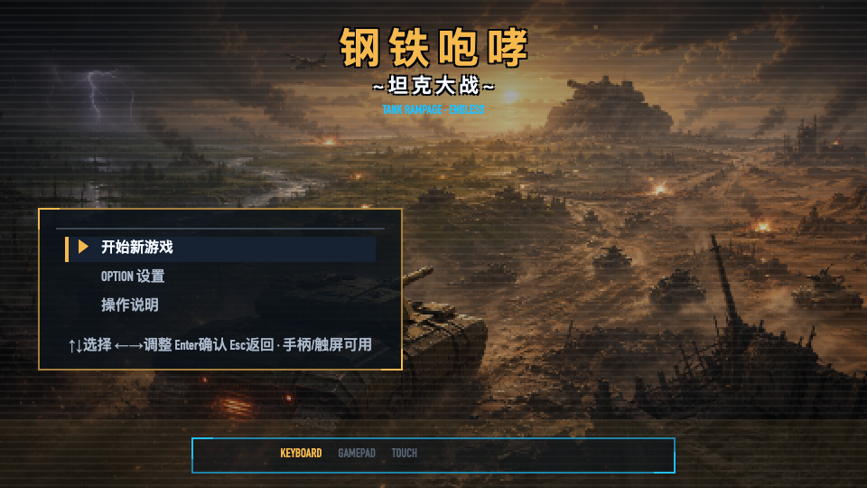
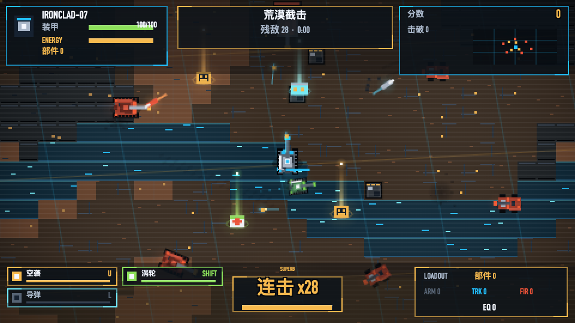

# 钢铁咆哮·坦克大战 — 现阶段开发状况报告

> 报告日期：2026-08-30 ｜ 当前版本：**v1.3.1**（Android versionCode 5）
> 所有截图均来自真实运行的游戏；性能与回归数据为本报告撰写当日实机实测。

---

## 一、一页总览

| 维度 | 现状 |
|---|---|
| 产品形态 | 浏览器单文件游戏（`index.html`，5MB 自包含）+ Android 原生 WebView 壳 APK + GitHub Pages 在线版 |
| 最新版本 | v1.3.1（2026-08-30）：页面导览全交互实测发现的 4 个问题已修复 |
| 发布产物 | `钢铁咆哮-坦克大战-v1.3.1.apk`（24.4MB）已构建；GitHub Pages 部署流水线已合入 |
| 本次实机验证 | **70 FPS**、renderMs≈0.65、**零 console error**；冒烟回归 14/17（3 项 FAIL 经实测确认为脚本断言过时，非产品缺陷） |
| 待办 | ① 8 个文件的 v1.3.1 改动尚未提交推送（推送即触发 Pages 部署）② 冒烟脚本需适配 v1.3 出击前菜单流 |
| 下一阶段 | v3 战役化：数据驱动关卡、永久成长、雷达/僚机系统扩展、美术统一（见第七节） |

**标题画面（v1.3.1 实拍）**

---

## 二、版本演进时间线

### 对外发布线（Android APK）

| 版本 | 日期 | 主题 |
|---|---|---|
| v1.0 | 08-30 凌晨 | 首个 Android 发布：v2 功能基线全量（三端操作/三语/5 难度/7 关/存档/NG+） |
| v1.1 | 08-30 | 盖世小鸡 X2S 等安卓手柄适配（HAT 十字键、RT/LT 扳机别名）、按键提示自动切换、开局「战前键位速览」动态演示页 |
| v1.2 | 08-30 | 失败/通关/结算画面提示输入感知化（手柄 A/B/X、触屏点按），补齐三端操作 |
| v1.3 | 08-30 傍晚 | **三机体选择**（突击/均衡/重装，三种护盾+分锁导弹）、**僚机系统**（突击/防御/自适应/无）、魂斗罗秘籍 DEBUG MODE、实况演示窗、帮助扩至 13 页 |
| **v1.3.1** | 08-30 晚 | 页面导览全交互实测修复（菜单残留命中区 P0、键位速览文字叠压、设置项触屏只进不退 ×2） |

### 内部迭代线（vNext 计划，已并入主线）

| 阶段 | 内容 |
|---|---|
| v3.1 架构重构 | 单文件拆为 `src/` 8 模块 2771 行 + `index.dev.html` 开发态 + `build.js` 单文件构建；60Hz 固定逻辑 + rAF 插值渲染 + 对象池 + 空间网格 + F3 性能面板 + AUTO 画质档 |
| v3.2 移动+连击 | 360° 速度向量移动模型（模拟摇杆原生 360°）；5 秒连击链、每 10 连阶段强化、60+ Overdrive、掉落倍率 |
| v3.3 战斗基础 | DamageEvent 统一伤害归因（12 种 cause、连锁深度≤3）、Parry 双层分级（Perfect 反弹 ×2.5）、Breach Ram 状态机（顶住→零距离炮击→按质量击飞→殉爆连锁） |
| v3.4 HD-2D 视觉第一轮 | 七层爆炸、Decal 层（履带痕/弹坑）、掉落信标光柱、环境色调分级、氛围包、HUD 精修、敌军锈红重涂；视觉模型评分 **58 → 76 → 聚焦复核 6/6 PASS** |

---

## 三、v1.3.1 本次变更明细（当前未提交）

来源：「页面与按钮导览」全交互实测（Android 模拟器 + CDP 走查），共 4 项修复：

1. **菜单残留命中区（P0）** — 菜单关闭后 `MENU_RECTS` 不清理，旧按钮区在新页面点按无效且抛 `TypeError`（画面左下角出红色 ERR 条），失败画面「点按屏幕重试」正中招。修复：`draw()` 每帧无菜单时清空命中表（与 `TAP_RECTS` 同策略）。实测：over 界面中央点按直接重试、错误条全程干净。
2. **键位速览页文字叠压（P1）** — 右侧演示窗下方三个文字 y 坐标互相踩。修复：分区重排，4 行说明也收在底部动作条之内。
3. **设置项触屏只进不退（P1）** — 「难度」「BGM 音量」「音效 音量」clamp 到顶即卡死。修复：改为循环切换（4→0 回绕）。实测：难度 4→0、BGM 4→0、音效 3→4。
4. 说明书 4 张受影响截图已用修复后构建重拍。

**未提交改动**（8 文件，+45/−22）：`src/game/ui.js`（核心修复）、`src/game/main.js`、`index.html`（构建产物）、APK assets 同步、`build.gradle`（版本号 1.3.1/code 5）、CHANGELOG、README、说明书；另有新文件：v1.3.1 APK、《页面与按钮导览》文档 + 27 张截图。已确认根目录 `index.html` 与 APK assets **完全同步**。

---

## 四、功能完成度盘点

| 模块 | 状态 | 说明 |
|---|---|---|
| 操作三端 | ✅ | 触屏 11 虚拟按钮 / 键盘 / 手柄（9 动作捕获式改键，localStorage 持久化），自动识别 |
| 多语言 | ✅ | 中/日/英实时切换，全 UI 覆盖 |
| 难度 | ✅ | 5 档（新兵→王牌），影响 AI/耐久/精准/掉落/报酬 ×1.0~2.0 |
| 关卡 | ✅ | 7 关配额 20→30，每关开场立绘卡；荒地扬尘/雨天闪电/河流沼泽/岩石地形 |
| 机体系统（v1.3） | ✅ | 突击/均衡/重装三选一，参数表+三种护盾+突击三枚分锁导弹 |
| 僚机系统（v1.3） | ✅ | 突击/防御/自适应/无，★推荐配对；实体防重叠已合入 |
| 武器 | ✅ | 机枪/主炮 AoE/蓄力追踪导弹/空袭 5sCD/涡轮/护盾瞬间格挡反弹 |
| 连击系统 | ✅ | 5s 链、Hits xN HUD 三语、每 10 连强化、60+ Overdrive |
| 高级战斗 | ✅ | Perfect Parry 反弹、Breach Ram 击飞连锁、DamageEvent 全归因统计 |
| 掉落/整备 | ✅ | 修理包/部件/装备 ×4，关后四维加点（可退回/一键重分） |
| 存档/NG+ | ✅ | 过关自动存档、标题「继续存档」、无限周目 HP 缩放 |
| DEBUG MODE（v1.3） | ✅ | 标题页 ↑↑↓↓←→←→JKEnter 开启，God/调参菜单，不写存档不刷分 |
| 音频 | ✅ | 11 条内嵌 CC0 BGM 无缝循环 + 状态机 + 合成器 SE，独立音量总线 |
| 帮助 | ✅ | 游戏内 13 页图文（含 v1.3 新增机体/僚机两页） |

---

## 五、质量与验证现状

### 5.1 本报告当日实机实测（v1.3.1 构建桌面 Chromium）

- 视觉场景 7 连截（title/combat/boss/units/explosion/weather/hud）全部正常出图；
- 性能：**fps=70，updateMs≈0，renderMs≈0.65**，AUTO 画质档 qLevel 2，零 console error；
- 真实路径复测：skipTo 出击 → 开战 → 击毁玩家 → over → **真实键盘 R → intro → play**，全程零页面错误。

### 5.2 冒烟回归 14/17 — 3 项 FAIL 的根因分析（重要）

本次实跑 `/tmp/tanksmoke.js` 结果为 14 PASS / 3 FAIL。经源码走查 + 真实路径复测，**3 项 FAIL 均为脚本断言停留在 v1.2 时代，非产品缺陷**：

| 失败项 | 根因 | 实测结论 |
|---|---|---|
| `intro state` / `play state` | 脚本假设 `G.start()` 直达 intro；v1.3 起 `startNewGame()` 改为打开「选机体→选僚机→键位速览」菜单覆盖层（`src/game/main.js:93`），需经菜单流出击 | 27 张模拟器导览截图 + 导览文档证实新流程全通 |
| `retry → intro` | 脚本先强制跳状态再调 `onKeyPress('KeyR')`，强制路径残留菜单层，被 `onKeyPress` 开头的 `if(MENU){menuKey(code);return}`（`main.js:104`）拦截 | 干净路径下真实 R 键死亡重试 **全通**（见 5.1） |

> **行动项**：更新冒烟脚本适配 v1.3 菜单流（预计 10 分钟），避免后续版本误报。真正的产品问题（v1.3.1 的 4 项）已在发布前修复并实测。

### 5.3 验证体系一览

| 层级 | 工具/记录 | 最近结果 |
|---|---|---|
| 主流程回归 | 39 项 | 全过（v3.3 时点） |
| 触屏回归 | 12 项 | 全过 |
| 冒烟套件 | 17 项 | 14/17（3 项断言过时，见 5.2） |
| 战斗链专项 | verify9 23 项（归因/Parry/Breach/连锁/顿帧） | 全过 ×多轮 |
| 视觉验收 | 视觉模型三轮审查 | 基线 58 → v2 76（9 PASS+1 PARTIAL）→ v3 复核 6/6 PASS，0 Blocker |
| 全交互实测 | 模拟器 + CDP，27 页面/按钮场景 | v1.3.1 修复后复检通过，产出《页面与按钮导览》 |

---

## 六、发布与文档产物

- **APK**：`钢铁咆哮-坦克大战-v1.3.1.apk`，24.4MB，包名 `com.rance.steelroar`，minSdk 24（Android 7.0+）/ targetSdk 35，横屏锁定沉浸全屏；签名 keystore 私有（已 gitignore，升级须同签名）。v1.3 留档保留。
- **GitHub Pages**：`pages.yml` 已合入（push main 即部署）；**v1.3.1 改动推送后线上版才会更新**。
- **玩家文档**（全部真机/模拟器实拍）：
  - 《游戏介绍与操作说明》— 23 图详细说明书（三模式操作/改键教程/七关图鉴/HUD 图解）；
  - 《页面与按钮导览》— 27 图逐页逐按钮实测导览（本次新增）。

**玩家视角关键画面**：

| | |
|---|---|
|  |  |
| v1.3 新增：机体三选一 | v1.3 新增：僚机四选一（★推荐配对） |
|  |  |
| 出击前键位速览（动态演示窗） | BOSS 登场与分段血条 |
|  |  |
| 战地整备四维加点 | 暂停菜单（战斗中可进设置/帮助） |

完整 27 张见 `output/android/页面导览/img/`；视觉回归 7 场景对照（baseline → v2 → v3 → v1.3.1）见 `output/visual/`。

---

## 七、风险与下一步

### 需要立即处理

1. **提交并推送 v1.3.1**：8 个文件改动 + 新产物仍未提交；push 到 main 会同时触发 GitHub Pages 更新线上版。
2. **冒烟脚本适配 v1.3**（见 5.2 行动项）：把 `G.start()` 断言改为走 hull→wingman→ctrl 菜单流，retry 用干净状态触发。

### 已知小项（非阻塞）

- BASELINE 记录的 3 个 Minor（BOSS 血条标签对比度、小屏 D-pad 间距、帮助页个别断行）仍未处理；
- keystore 单点：升级必须同签名，发 Google Play 前需换正式 keystore 并妥善保管。

### 下一版本方向（v3 战役化，计划文档《下一版的升级计划.md》）

- **数据驱动 MissionSystem**：关卡/波次/任务目标全部数据表化，消灭 `if(stage===3)` 式分支；每关任务目标差异化（不再纯清图）；
- **永久成长 + 搜集**：整备升级为模块树/蓝图/装备/涂装搜集；
- **雷达 + 僚机指令扩展**：RadarSystem、WingmanAI 独立成系统后再加特殊敌人；
- **战役结构**：8~10 关完整第一章 + 剧情；
- **HD-2D 美术统一**（v3.4 已完成第一轮，评分 76/100）：继续光照/粒子/景深迭代；
- **QA 持续**：Visual QA 模式（固定种子/场景直达）已就绪，`?scene=combat` 等七场景可直达。

---

## 八、本报告截图清单

| 文件 | 来源 |
|---|---|
| `output/visual/v1.3.1/title.png`、`combat.png` 等 7 张 | 本报告当日 v1.3.1 构建实拍（视觉回归场景） |
| `output/android/页面导览/img/01~27.png` | v1.3.1 修复后模拟器 CDP 实测截图 |
| `output/android/游戏说明书/img/` | 说明书真机截图 23 张 |
| `output/visual/{baseline,v2,v3}/` | HD-2D 视觉迭代三轮对照 |
